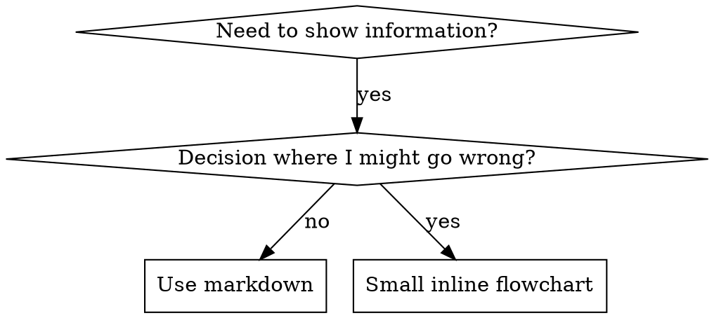

# スキルの作成

## 概要

**スキルの作成は、プロセスドキュメントに適用されたテスト駆動開発です。**

**個人スキルはエージェント固有のディレクトリに配置されます（Claude Code は `~/.claude/skills`、Codex は `~/.codex/skills`）**

テストケース（サブエージェントによるプレッシャーシナリオ）を書き、失敗を見て（ベースライン動作）、スキル（ドキュメント）を書き、テストがパスするのを見て（エージェントが準拠）、リファクタリング（抜け穴を塞ぐ）します。

**コア原則:** スキルなしでエージェントが失敗するのを見なければ、スキルが正しいことを教えているかわかりません。

**必須の前提知識:** このスキルを使用する前に superpowers:test-driven-development を理解する必要があります。そのスキルが基本的な RED-GREEN-REFACTOR サイクルを定義しています。このスキルは TDD をドキュメントに適応させたものです。

**公式ガイダンス:** Anthropic の公式スキル作成ベストプラクティスについては、anthropic-best-practices.md を参照してください。このドキュメントは、このスキルの TDD 重視のアプローチを補完する追加のパターンとガイドラインを提供します。

## スキルとは何か？

**スキル**は、実証済みのテクニック、パターン、またはツールのリファレンスガイドです。スキルは将来の Claude インスタンスが効果的なアプローチを見つけて適用するのに役立ちます。

**スキルであるもの:** 再利用可能なテクニック、パターン、ツール、リファレンスガイド

**スキルでないもの:** ある問題を一度解決した方法についての物語

## スキル向け TDD マッピング

| TDD の概念 | スキル作成 |
|-------------|----------------|
| **テストケース** | サブエージェントによるプレッシャーシナリオ |
| **プロダクションコード** | スキルドキュメント (SKILL.md) |
| **テスト失敗 (RED)** | スキルなしでエージェントがルール違反（ベースライン） |
| **テスト成功 (GREEN)** | スキルありでエージェントが準拠 |
| **リファクタリング** | コンプライアンスを維持しながら抜け穴を塞ぐ |
| **テストを先に書く** | スキルを書く前にベースラインシナリオを実行 |
| **失敗を見る** | エージェントが使う正確な合理化をドキュメント化 |
| **最小限のコード** | それらの特定の違反に対処するスキルを書く |
| **成功を見る** | エージェントが準拠することを確認 |
| **リファクタリングサイクル** | 新しい合理化を発見 → 塞ぐ → 再確認 |

スキル作成プロセス全体が RED-GREEN-REFACTOR に従います。

## スキルを作成すべきとき

**作成する場合:**
- テクニックが直感的に明らかでなかった
- プロジェクトをまたいで再び参照する
- パターンが広く適用できる（プロジェクト固有でない）
- 他の人が恩恵を受ける

**作成しない場合:**
- 一度きりの解決策
- 他で十分にドキュメント化された標準的なプラクティス
- プロジェクト固有の慣例（CLAUDE.md に記載）
- 機械的な制約（正規表現/バリデーションで強制できるなら自動化する—ドキュメントは判断が必要なケースに使う）

## スキルの種類

### テクニック
手順に従う具体的な方法 (condition-based-waiting, root-cause-tracing)

### パターン
問題について考えるための方法 (flatten-with-flags, test-invariants)

### リファレンス
API ドキュメント、構文ガイド、ツールドキュメント (Office ドキュメント)

## ディレクトリ構造


```
skills/
  skill-name/
    SKILL.md              # メインリファレンス（必須）
    supporting-file.*     # 必要な場合のみ
```

**フラット名前空間** - すべてのスキルが1つの検索可能な名前空間に

**別ファイルにする場合:**
1. **大量のリファレンス** (100行以上) - API ドキュメント、包括的な構文
2. **再利用可能なツール** - スクリプト、ユーティリティ、テンプレート

**インラインに保つ:**
- 原則と概念
- コードパターン (50行未満)
- その他すべて

## SKILL.md の構造

**フロントマター (YAML):**
- サポートされるフィールドは `name` と `description` の2つのみ
- 合計最大1024文字
- `name`: 文字、数字、ハイフンのみ使用（括弧、特殊文字なし）
- `description`: 三人称、使用するタイミングのみを記述（何をするかではない）
  - "Use when..." で始めてトリガー条件に焦点を当てる
  - 具体的な症状、状況、コンテキストを含める
  - **スキルのプロセスやワークフローを要約しない** (理由は CSO セクションを参照)
  - 可能であれば500文字以下に保つ

```markdown
---
name: Skill-Name-With-Hyphens
description: Use when [具体的なトリガー条件と症状]
---

# スキル名

## 概要
これは何か？1-2文でコア原則。

## 使用タイミング
[判断が非自明な場合、小さなインラインフローチャート]

症状とユースケースの箇条書き
使用しないタイミング

## コアパターン (テクニック/パターン向け)
ビフォー/アフターのコード比較

## クイックリファレンス
一般的な操作のスキャン用テーブルまたは箇条書き

## 実装
シンプルなパターンはインラインコード
大量のリファレンスや再利用可能なツールはファイルへのリンク

## よくある間違い
何がうまくいかないか + 修正方法

## 実際の影響 (オプション)
具体的な成果
```


## Claude 検索最適化 (CSO)

**発見に重要:** 将来の Claude がスキルを見つける必要がある

### 1. 充実した説明フィールド

**目的:** Claude は与えられたタスクに対してどのスキルをロードするか決定するために説明を読む。「このスキルを今読むべきか？」に答えられるようにする。

**フォーマット:** "Use when..." で始めてトリガー条件に焦点を当てる

**重要: 説明 = 使用タイミング、スキルの内容ではない**

説明にはトリガー条件のみを記述すべきです。スキルのプロセスやワークフローを説明に要約しないでください。

**これが重要な理由:** テストにより、説明がスキルのワークフローを要約すると、Claude はスキルの完全な内容を読む代わりに説明に従う可能性があることが判明しました。「タスク間のコードレビュー」という説明は、スキルのフローチャートが明確に2回のレビュー（仕様準拠、次にコード品質）を示していたにもかかわらず、Claude に1回のレビューのみを行わせました。

説明を「Use when executing implementation plans with independent tasks」（ワークフローの要約なし）に変更したところ、Claude はフローチャートを正しく読み、2段階のレビュープロセスに従いました。

**罠:** ワークフローを要約する説明は Claude が利用するショートカットを作成します。スキル本体は Claude がスキップするドキュメントになります。

```yaml
# BAD: ワークフローを要約 - Claude はスキルを読む代わりにこれに従う可能性
description: Use when executing plans - dispatches subagent per task with code review between tasks

# BAD: プロセスの詳細が多すぎる
description: Use for TDD - write test first, watch it fail, write minimal code, refactor

# GOOD: トリガー条件のみ、ワークフローの要約なし
description: Use when executing implementation plans with independent tasks in the current session

# GOOD: トリガー条件のみ
description: Use when implementing any feature or bugfix, before writing implementation code
```

**コンテンツ:**
- このスキルが適用されることを示す具体的なトリガー、症状、状況を使用
- *言語固有の症状* (setTimeout, sleep) ではなく *問題* (競合状態、不一致動作) を記述
- スキル自体が技術固有でない限り、トリガーをテクノロジー非依存に保つ
- スキルが技術固有の場合は、トリガーでそれを明示する
- 三人称で記述（システムプロンプトに注入される）
- **スキルのプロセスやワークフローを要約しない**

```yaml
# BAD: 抽象的すぎる、曖昧、使用タイミングを含まない
description: For async testing

# BAD: 一人称
description: I can help you with async tests when they're flaky

# BAD: テクノロジーに言及しているがスキルはそれに固有ではない
description: Use when tests use setTimeout/sleep and are flaky

# GOOD: "Use when" で始まり、問題を記述、ワークフローなし
description: Use when tests have race conditions, timing dependencies, or pass/fail inconsistently

# GOOD: 明示的なトリガーを持つ技術固有のスキル
description: Use when using React Router and handling authentication redirects
```

### 2. キーワードカバレッジ

Claude が検索するであろう言葉を使用:
- エラーメッセージ: "Hook timed out", "ENOTEMPTY", "race condition"
- 症状: "flaky", "hanging", "zombie", "pollution"
- 同義語: "timeout/hang/freeze", "cleanup/teardown/afterEach"
- ツール: 実際のコマンド、ライブラリ名、ファイルタイプ

### 3. 説明的な命名

**能動態、動詞先頭を使用:**
- `creating-skills` > `skill-creation`
- `condition-based-waiting` > `async-test-helpers`

### 4. トークン効率 (重要)

**問題:** getting-started や頻繁に参照されるスキルはすべての会話にロードされる。すべてのトークンが重要。

**目標語数:**
- getting-started ワークフロー: 各150語未満
- 頻繁にロードされるスキル: 合計200語未満
- その他のスキル: 500語未満（それでも簡潔に）

**テクニック:**

**詳細をツールヘルプに移動:**
```bash
# BAD: SKILL.md にすべてのフラグをドキュメント化
search-conversations supports --text, --both, --after DATE, --before DATE, --limit N

# GOOD: --help を参照
search-conversations supports multiple modes and filters. Run --help for details.
```

**相互参照を使用:**
```markdown
# BAD: ワークフローの詳細を繰り返す
When searching, dispatch subagent with template...
[20行の繰り返し指示]

# GOOD: 他のスキルを参照
Always use subagents (50-100x context savings). REQUIRED: Use [other-skill-name] for workflow.
```

**例を圧縮:**
```markdown
# BAD: 冗長な例 (42語)
your human partner: "How did we handle authentication errors in React Router before?"
You: I'll search past conversations for React Router authentication patterns.
[Dispatch subagent with search query: "React Router authentication error handling 401"]

# GOOD: 最小限の例 (20語)
Partner: "How did we handle auth errors in React Router?"
You: Searching...
[Dispatch subagent → synthesis]
```

**冗長性を排除:**
- 相互参照したスキルの内容を繰り返さない
- コマンドから明らかなことを説明しない
- 同じパターンの複数の例を含めない

**検証:**
```bash
wc -w skills/path/SKILL.md
# getting-started ワークフロー: 各150未満を目標
# その他の頻繁にロードされるもの: 合計200未満を目標
```

**行うこと・コアインサイトで命名:**
- `condition-based-waiting` > `async-test-helpers`
- `using-skills` > `skill-usage`
- `flatten-with-flags` > `data-structure-refactoring`
- `root-cause-tracing` > `debugging-techniques`

**動名詞 (-ing) はプロセスに適している:**
- `creating-skills`, `testing-skills`, `debugging-with-logs`
- 能動的、実行しているアクションを説明

### 4. 他のスキルの相互参照

**他のスキルを参照するドキュメントを書くとき:**

スキル名のみを使用し、明示的な要件マーカーを付ける:
- 良い: `**REQUIRED SUB-SKILL:** Use superpowers:test-driven-development`
- 良い: `**REQUIRED BACKGROUND:** You MUST understand superpowers:systematic-debugging`
- 悪い: `See skills/testing/test-driven-development` (必須かどうか不明確)
- 悪い: `@skills/testing/test-driven-development/SKILL.md` (強制ロード、コンテキストを消費)

**@ リンクを使わない理由:** `@` 構文はファイルを即座に強制ロードし、必要になる前に200k以上のコンテキストを消費します。

## フローチャートの使用



**フローチャートを使用するのは以下の場合のみ:**
- 非自明な判断ポイント
- 早く止めてしまう可能性のあるプロセスループ
- 「A vs B のどちらを使うか」の判断

**フローチャートを使用しない場合:**
- リファレンス資料 → テーブル、リスト
- コード例 → マークダウンブロック
- 線形な指示 → 番号付きリスト
- 意味のないラベル (step1, helper2)

Graphviz スタイルルールは @graphviz-conventions.dot を参照。

**パートナー向けの可視化:** このディレクトリの `render-graphs.js` を使用してスキルのフローチャートを SVG にレンダリング:
```bash
./render-graphs.js ../some-skill           # 各ダイアグラムを個別に
./render-graphs.js ../some-skill --combine # すべてのダイアグラムを1つの SVG に
```

## コード例

**1つの優れた例が多数の平凡な例に勝る**

最も関連性の高い言語を選択:
- テストテクニック → TypeScript/JavaScript
- システムデバッグ → Shell/Python
- データ処理 → Python

**良い例:**
- 完全で実行可能
- なぜかを説明するコメント付き
- 実際のシナリオから
- パターンを明確に示す
- 適応可能（汎用テンプレートではない）

**してはいけないこと:**
- 5つ以上の言語で実装
- 穴埋めテンプレートを作成
- 不自然な例を書く

あなたはポーティングが得意 - 1つの優れた例で十分です。

## ファイル構成

### 自己完結型スキル
```
defense-in-depth/
  SKILL.md    # すべてインライン
```
使用タイミング: すべてのコンテンツが収まり、大量のリファレンス不要

### 再利用可能なツール付きスキル
```
condition-based-waiting/
  SKILL.md    # 概要 + パターン
  example.ts  # 適応可能なワーキングヘルパー
```
使用タイミング: ツールが単なる説明ではなく再利用可能なコード

### 大量のリファレンス付きスキル
```
pptx/
  SKILL.md       # 概要 + ワークフロー
  pptxgenjs.md   # 600行 API リファレンス
  ooxml.md       # 500行 XML 構造
  scripts/       # 実行可能ツール
```
使用タイミング: リファレンス資料がインラインに収まらないほど大きい

## 鉄の法則（TDD と同じ）

```
失敗するテストなしにスキルを作成しない
```

これは新規スキルと既存スキルの編集の両方に適用されます。

テスト前にスキルを書いた？削除。やり直し。
テストなしでスキルを編集した？同じ違反。

**例外なし:**
- 「シンプルな追加」でも
- 「セクションを追加するだけ」でも
- 「ドキュメントの更新」でも
- テストされていない変更を「参考」として保持しない
- テスト実行中に「適応」しない
- 削除は削除を意味する

**必須の前提知識:** superpowers:test-driven-development スキルがなぜこれが重要かを説明しています。同じ原則がドキュメントにも適用されます。

## すべてのスキルタイプのテスト

異なるスキルタイプには異なるテストアプローチが必要:

### 規律を強制するスキル（ルール/要件）

**例:** TDD、完了前の検証、コーディング前の設計

**テスト方法:**
- 学問的な質問: ルールを理解しているか？
- プレッシャーシナリオ: ストレス下で準拠するか？
- 複数のプレッシャーの組み合わせ: 時間 + サンクコスト + 疲労
- 合理化を特定し明示的な反論を追加

**成功基準:** 最大プレッシャー下でエージェントがルールに従う

### テクニックスキル（ハウツーガイド）

**例:** condition-based-waiting, root-cause-tracing, defensive-programming

**テスト方法:**
- 適用シナリオ: テクニックを正しく適用できるか？
- バリエーションシナリオ: エッジケースを処理できるか？
- 情報欠落テスト: 指示にギャップがないか？

**成功基準:** エージェントが新しいシナリオにテクニックを正常に適用

### パターンスキル（メンタルモデル）

**例:** reducing-complexity, information-hiding の概念

**テスト方法:**
- 認識シナリオ: パターンが適用されるタイミングを認識するか？
- 適用シナリオ: メンタルモデルを使用できるか？
- 反例: 適用しないタイミングを知っているか？

**成功基準:** エージェントがパターンの適用タイミング/方法を正しく特定

### リファレンススキル（ドキュメント/API）

**例:** API ドキュメント、コマンドリファレンス、ライブラリガイド

**テスト方法:**
- 検索シナリオ: 適切な情報を見つけられるか？
- 適用シナリオ: 見つけた情報を正しく使用できるか？
- ギャップテスト: 一般的なユースケースがカバーされているか？

**成功基準:** エージェントがリファレンス情報を見つけて正しく適用

## テストスキップの一般的な合理化

| 言い訳 | 現実 |
|--------|---------|
| 「スキルは明らかに明確」 | あなたに明確 ≠ 他のエージェントに明確。テストする。 |
| 「単なるリファレンス」 | リファレンスにもギャップや不明確なセクションがありうる。検索をテスト。 |
| 「テストは過剰」 | テストされていないスキルには問題がある。常に。15分のテストが数時間を節約。 |
| 「問題が出たらテスト」 | 問題 = エージェントがスキルを使えない。デプロイ前にテスト。 |
| 「テストは面倒」 | テストは本番環境で悪いスキルをデバッグするより面倒ではない。 |
| 「品質に自信がある」 | 過信は問題を保証する。とにかくテスト。 |
| 「学術的レビューで十分」 | 読む ≠ 使う。適用シナリオをテスト。 |
| 「テストする時間がない」 | テストされていないスキルのデプロイは後で修正により多くの時間を浪費する。 |

**これらすべての意味: デプロイ前にテスト。例外なし。**

## 合理化に対するスキルの防弾化

規律を強制するスキル（TDD など）は合理化に抵抗する必要があります。エージェントは賢く、プレッシャー下で抜け穴を見つけます。

**心理学ノート:** 説得テクニックがなぜ機能するかを理解することで、体系的に適用できます。権威、コミットメント、希少性、社会的証明、一体性の原則に関する研究基盤は persuasion-principles.md を参照（Cialdini, 2021; Meincke et al., 2025）。

### すべての抜け穴を明示的に塞ぐ

ルールを述べるだけでなく、具体的な回避策を禁止:

<Bad>
```markdown
Write code before test? Delete it.
```
</Bad>

<Good>
```markdown
Write code before test? Delete it. Start over.

**No exceptions:**
- Don't keep it as "reference"
- Don't "adapt" it while writing tests
- Don't look at it
- Delete means delete
```
</Good>

### 「精神 vs 文字」の議論に対処する

基盤となる原則を早めに追加:

```markdown
**Violating the letter of the rules is violating the spirit of the rules.**
```

これにより「精神に従っている」合理化のクラス全体を遮断。

### 合理化テーブルを構築する

ベースラインテストから合理化を収集（以下のテストセクション参照）。エージェントが出すすべての言い訳をテーブルに:

```markdown
| Excuse | Reality |
|--------|---------|
| "Too simple to test" | Simple code breaks. Test takes 30 seconds. |
| "I'll test after" | Tests passing immediately prove nothing. |
| "Tests after achieve same goals" | Tests-after = "what does this do?" Tests-first = "what should this do?" |
```

### レッドフラグリストを作成

エージェントが合理化しているときの自己チェックを容易にする:

```markdown
## Red Flags - STOP and Start Over

- Code before test
- "I already manually tested it"
- "Tests after achieve the same purpose"
- "It's about spirit not ritual"
- "This is different because..."

**All of these mean: Delete code. Start over with TDD.**
```

### 違反症状で CSO を更新

説明に追加: ルールを違反しようとしているときの症状:

```yaml
description: use when implementing any feature or bugfix, before writing implementation code
```

## スキルの RED-GREEN-REFACTOR

TDD サイクルに従う:

### RED: 失敗するテストを書く（ベースライン）

スキルなしでサブエージェントによるプレッシャーシナリオを実行。正確な動作をドキュメント化:
- どんな選択をしたか？
- どんな合理化を使ったか（逐語的に）？
- どのプレッシャーが違反を引き起こしたか？

これは「テストの失敗を見る」 - スキルを書く前にエージェントが自然に何をするか見る必要がある。

### GREEN: 最小限のスキルを書く

それらの具体的な合理化に対処するスキルを書く。仮想的なケース用の追加コンテンツは追加しない。

同じシナリオをスキル付きで実行。エージェントが準拠するはず。

### REFACTOR: 抜け穴を塞ぐ

エージェントが新しい合理化を見つけた？明示的な反論を追加。防弾になるまで再テスト。

**テスト方法論:** 完全なテスト方法論は @testing-skills-with-subagents.md を参照:
- プレッシャーシナリオの書き方
- プレッシャーの種類（時間、サンクコスト、権威、疲労）
- 体系的な穴塞ぎ
- メタテストテクニック

## アンチパターン

### ナラティブの例
「2025-10-03のセッションで、空の projectDir が原因で...」
**ダメな理由:** 具体的すぎ、再利用不可

### 多言語による希薄化
example-js.js, example-py.py, example-go.go
**ダメな理由:** 品質が平凡、メンテナンス負担

### フローチャート内のコード
```dot
step1 [label="import fs"];
step2 [label="read file"];
```
**ダメな理由:** コピペできない、読みにくい

### 汎用ラベル
helper1, helper2, step3, pattern4
**ダメな理由:** ラベルには意味的な意味が必要

## 停止: 次のスキルに進む前に

**スキルを書いた後、必ず停止してデプロイプロセスを完了する必要があります。**

**してはいけないこと:**
- 各テストなしにバッチでスキルを作成
- 現在のスキルが検証される前に次に進む
- 「バッチの方が効率的」だからテストをスキップ

**以下のデプロイチェックリストは各スキルに対して必須です。**

テストされていないスキルのデプロイ = テストされていないコードのデプロイ。品質基準の違反です。

## スキル作成チェックリスト（TDD 適応版）

**重要: TodoWrite を使用して以下の各チェックリスト項目の todo を作成してください。**

**RED フェーズ - 失敗するテストを書く:**
- [ ] プレッシャーシナリオを作成（規律スキルは3つ以上のプレッシャーを組み合わせ）
- [ ] スキルなしでシナリオを実行 - ベースラインの動作を逐語的にドキュメント化
- [ ] 合理化/失敗のパターンを特定

**GREEN フェーズ - 最小限のスキルを書く:**
- [ ] 名前は文字、数字、ハイフンのみ使用（括弧/特殊文字なし）
- [ ] name と description のみの YAML フロントマター（最大1024文字）
- [ ] 説明は "Use when..." で始まり具体的なトリガー/症状を含む
- [ ] 説明は三人称で記述
- [ ] 検索用キーワードを全体に（エラー、症状、ツール）
- [ ] コア原則を含む明確な概要
- [ ] RED で特定した具体的なベースライン失敗に対処
- [ ] コードはインラインまたは別ファイルへのリンク
- [ ] 1つの優れた例（多言語でない）
- [ ] スキル付きでシナリオを実行 - エージェントが準拠することを確認

**REFACTOR フェーズ - 抜け穴を塞ぐ:**
- [ ] テストから新しい合理化を特定
- [ ] 明示的な反論を追加（規律スキルの場合）
- [ ] すべてのテストイテレーションから合理化テーブルを構築
- [ ] レッドフラグリストを作成
- [ ] 防弾になるまで再テスト

**品質チェック:**
- [ ] 判断が非自明な場合のみ小さなフローチャート
- [ ] クイックリファレンステーブル
- [ ] よくある間違いセクション
- [ ] ナラティブストーリーテリングなし
- [ ] サポートファイルはツールまたは大量のリファレンスのみ

**デプロイ:**
- [ ] スキルを git にコミットしフォークにプッシュ（設定されている場合）
- [ ] PR で貢献を検討（広く有用な場合）

## 発見ワークフロー

将来の Claude がスキルを見つける方法:

1. **問題に遭遇** (「テストがフレーキー」)
3. **スキルを発見** (説明が一致)
4. **概要をスキャン** (これは関連性があるか？)
5. **パターンを読む** (クイックリファレンステーブル)
6. **例をロード** (実装時のみ)

**このフローに最適化** - 検索可能な用語を早く頻繁に配置。

## 結論

**スキルの作成は、プロセスドキュメントの TDD です。**

同じ鉄の法則: 失敗するテストなしにスキルを作成しない。
同じサイクル: RED（ベースライン）→ GREEN（スキル作成）→ REFACTOR（抜け穴を塞ぐ）。
同じ恩恵: より良い品質、少ないサプライズ、防弾の結果。

コードに TDD を適用するなら、スキルにも適用する。ドキュメントに適用された同じ規律です。
