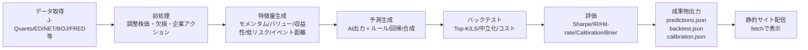

# 静的サイトで運用できるエビデンスベース投資意思決定支援の設計指針

## エグゼクティブサマリー

本レポートは「週次のAI株価アップサイド予測」を表示する**DBなしの静的サイト**に対し、投資判断の質（誤解の減少・リスク管理・再現性）を上げるための **Evidence-based（実証研究＋実務ベストプラクティス）意思決定支援機能**を、**JSON または Google Sheets に保存可能**という制約の下で提案する。前提として、現在のAI出力は少なくとも「（a）銘柄別スコア/ランキング」または「（b）期待アップサイド（%）」相当を週次で提供していると仮定する。さらに、意思決定支援として有効性が高いのは、**予測の“当たり外れ”だけでなく、（1）確率の校正（calibration）と不確実性の提示、（2）研究で裏づけのある複数シグナルとの整合性表示、（3）リスク調整後の比較、（4）バックテストの透明化と過学習対策**である。citeturn33view0turn1search3turn31view1turn31view3

学術面の最重要ポイントは次の通り。**価格モメンタム**（過去の勝者が短中期で相対的に強い）citeturn0search17、**バリュー/サイズ**（B/Mやサイズが平均リターン断面を説明）citeturn0search2、**収益モメンタム（earnings momentum）**citeturn0search7、**ボラティリティ（特に“ボラへの感応度”や特異ボラ）と平均リターンの関係**citeturn26view2、**収益性・投資因子（FF5など）**citeturn1search10、**低ベータ/低リスクの異常（BAB等）**citeturn7search3、**アナリスト推奨・変更の情報価値**citeturn8search4turn1search13 が、意思決定支援に直結しやすい「指標の柱」になる。一方、**マクロ変数による株式リスクプレミアム予測は、提案変数が多い割にアウト・オブ・サンプルで不安定**であることが示されており、マクロは「単独で売買」よりも**注釈（regime）やリスク量調整の補助**として使う設計が安全側である。citeturn2search4turn10search19

実装面では、日本株中心なら entity["company","JPX総研","data services, Tokyo, JP"] の J-Quants が、株価・財務・配当・決算予定などをまとまって取得でき、レート制限や更新時刻も公開されている（例：Free 5 req/min、Light 60、Standard 120、Premium 500）。citeturn19view0turn34view3turn21search1 ただし利用形態に制約があり、個人の私的利用限定・データの第三者配布禁止などが明示されているため、「サイトがデータそのものを再配布していないか」を設計段階で必ず点検する必要がある。citeturn34view0  
日本の開示（XBRL等）は entity["organization","金融庁","regulator, Tokyo, JP"] の EDINET API が仕様書として公開されており、書類取得APIのURL構造や取得形式（ZIP/PDF等）が明確である。citeturn25view0turn25view1 マクロは entity["organization","日本銀行","central bank, Tokyo, JP"] の時系列API（JSON/CSV）が2026年2月にマニュアル更新されている。citeturn25view2

---

## エビデンスベース

静的サイトの意思決定支援で重要なのは、「予測モデル」そのものよりも **予測を“意思決定に変換する”ための、実証済みの補助情報・評価指標・リスク尺度**である。本節では、週次の株アップサイド予測に直接組み合わせやすい要素を、学術（原典中心）＋業界資料＋評価理論で整理する。

**価格モメンタム（cross-sectional momentum）**  
過去一定期間で相対的に上昇した銘柄（勝者）を買い、下落した銘柄（敗者）を売る戦略が有意な収益を生むことが示され、モメンタムは株式横断面の代表的アノマリー/スタイルとして定着した。citeturn0search17turn0search7 週次サイトでは「直近12か月（直近1か月除外など）のリターン順位」「52週高値からの距離」「短期リバーサル（1週〜1か月）」を分けて提示すると、モメンタムの時間軸（短期は反転しやすい等）をユーザが誤解しにくい。citeturn0search17turn0search7

**バリュー（value）とサイズ（size）**  
サイズと簿価時価比率（book-to-market）が、平均リターンの断面差をよく捉えることが示され、以後の因子モデルの基礎になった。citeturn0search2 静的サイトの意思決定支援としては、個別銘柄に「P/B、E/P、FCF利回り、EV/EBITDA」等を並べ、AI予測が「割高銘柄のさらなる上昇」を示しているのか、「割安回帰」を示しているのかを分解して理解できるようにするのが有効である。citeturn0search2

**収益性・投資（profitability / investment）と“クオリティ”**  
収益性（profitability）や投資（investment）を組み込む因子モデル（いわゆる5因子）が3因子より説明力が高いことが示され、また粗利益/資産などの収益性指標が横断面リターンを予測することも示されている。citeturn1search10turn7search4 産業界でも、バリュー・モメンタム・クオリティ/ディフェンシブ等の「スタイル」を分散して持つ考え方が整理されている（ただしホワイトペーパーは前提・実装が異なるため“研究の代替”ではなく補助として参照）。citeturn8search7turn8search3

**ボラティリティ/低リスク（low vol / low beta）**  
ボラティリティリスクの価格付けや、特異ボラティリティが高い銘柄の平均リターンが低いといった結果が報告されている。citeturn26view2 また、低ベータをロング・高ベータをショートする“BAB”型のスタイルが正のリスク調整後リターンを示すという議論もある。citeturn7search3 静的サイトでの実装は、(1) 過去ボラ（例：20日年率化）(2) β（対指数）(3) 下方リスク（最大ドローダウン、下方偏差）を最低限として、AIが示すアップサイドと「想定変動・想定下振れ」を同じカード内に置くのが有効。citeturn26view2turn24view2

**決算・業績修正・アナリスト（earnings revisions / upgrades）**  
企業情報への市場の反応が即時に完結しない（ドリフトが残る）可能性や、アナリスト推奨が情報価値を持つ可能性を示す研究がある。citeturn8search4turn1search13 実装上は、無料で継続取得できる“アナリスト予想の改定データ”が入手しづらいことが多いため、まずは「決算予定日・配当落ち日・開示（有報/四半期）更新」などイベント注釈から着手し、将来は有償データ（契約可能なら）でEPS改定を足す段階設計が現実的である。citeturn13view0turn21search9turn25view0

**マクロシグナル（regime）と“使いどころ”**  
配当利回りやバリュエーション比率が長期リターンを予測しうるという研究がある一方、数多く提案されてきた予測変数のアウト・オブ・サンプル性能が弱い/不安定であるという包括的検証もある。citeturn2search5turn2search4 実務的には、マクロは「当てに行く」より、(1) リスク量（ボラターゲット）(2) セクター中立化の強度 (3) レバレッジ抑制 といった“安全弁”に使う方が説明責任と頑健性が高い。citeturn12search8turn10search19

**確率予測の評価（calibration）と意思決定**  
意思決定支援として「確率」を出すなら、**校正（calibration）**と**鋭さ（sharpness）**を評価し、適切なスコア（proper scoring rules）で比較するのが理論的に一貫している。citeturn33view0turn0search8 古典的にはBrier Scoreが確率予測の検証に用いられ、citeturn1search3 現代の機械学習でも、温度スケーリング等の後処理で校正改善できることが示されている。citeturn33view1 また、分類器スコアを確率に写像する方法（Platt scaling）も古典的手法として整理されている。citeturn33view2

---

## 投資判断支援の機能提案

以下は「静的サイト（DBなし）」で、**JSONまたはSheetsに入れたデータを配信**するだけで実装しやすく、かつ投資判断を誤らせにくい順に並べた機能群である。UIは後から変更可能との前提に合わせ、ここでは **必要入出力・更新頻度・画面構造（モック案）**に重点を置く。

### 機能比較テーブル（実装難易度・データ要件・効果）

| 機能 | 主要な期待効果 | 実装難易度 | 主データ要件 | 更新頻度の目安 | 静的サイトでの実装要点 |
|---|---|---:|---|---|---|
| 予測の校正（Calibration）ダッシュボード | 「信頼度0.7は本当に7割当たるか」を可視化し、誤解を減らす | 中 | 予測確率 + 実現結果（horizon固定） | 週次（予測更新時） | オフライン集計→reliability用JSONを配信 |
| 期待リターン×リスク（分布・ボラ・下振れ）表示 | アップサイドだけでなく“取りうる損失”を同時提示 | 低〜中 | 株価（調整後） | 週次（+日次も可） | 20日/60日ボラ、最大DD等を事前計算 |
| エビデンス指標スナップショット（モメンタム/バリュー/クオリティ/低リスク） | AI予測が“どのタイプの上昇”かを説明し納得感を上げる | 中 | 価格 + 財務（最低限P/B等） | 週次〜月次 | z-score標準化して「支持/反対」を表示 |
| シグナル集約（単純合成）とランキングの分解表示 | 単一モデル依存を軽減し、頑健性を上げる | 中 | 複数指標（上記） | 週次 | 合成スコアの内訳を配信 |
| セクター/市場中立ランキング | テーマ偏り・ベータ偏りを抑え「純粋な銘柄選好」に近づける | 中〜高 | セクター分類 + 指数リターン | 週次 | セクター内順位→全体統合、β補正 |
| バックテスト/検証レポート（手数料・回転率込み） | “いつ/どの条件で効いたか”を透明化 | 中〜高 | 価格（調整後）+ 取引ルール | 週次（結果）/随時（再計算） | オフラインで全計算しJSON化、静的表示 |
| 過学習警告（PBO/DSR/Reality Check簡易） | 「良すぎるバックテスト」への抑止 | 高 | 多数の試行ログ or パラメータ探索痕跡 | リリース時 | 研究用途はオフライン、要点だけ公開 |
| イベント注釈（決算/配当/開示） | 予測がイベント由来の変動を含む可能性を明示 | 低 | 決算予定・配当・開示 | 日次〜週次 | カレンダーJSON＋銘柄カード注釈 |
| 局所説明（SHAP風：寄与度上位3つ） | “なぜこの銘柄？”を短文で説明 | 中 | 特徴量 + モデル出力 | 週次 | SHAP等はオフライン計算し結果のみ配信 |
| アラート（RSS/JSONフィード） | “必要な時だけ見る”導線を作る | 低 | 新規予測/順位変化 | 週次 | RSS生成は静的で可能（購読） |

根拠となる設計思想：確率表示は校正評価が必要（proper scoring、reliability）citeturn33view0turn1search3、リスク調整後指標（Sharpe/IR等）を併用すると比較の誤解を減らせるciteturn24view2turn26view1、バックテストはデータスヌーピング/過学習の罠が大きく、統計的補正や注意喚起が重要。citeturn31view3turn31view1turn31view2

### 機能ごとの入出力・更新頻度・UXモック案

**予測の校正（Calibration）／信頼度の品質管理**  
入力：週次予測（確率またはスコア→確率化）＋将来リターン実現値（例：1週後、4週後）  
出力：Brier Score、ログ損失、Reliability diagram用bin集計、Expected Calibration Error（ECE）相当の集計値  
更新：週次（新しい週の“結果”が確定したタイミングでリフレッシュ）  
UXモック：  
- 「今週の予測は強いが、過去12か月の校正は○○」のように、ランキングの上に**“予測品質の帯”**を常設  
- 信頼度（例：0.8）にマウスオーバーすると「過去ではこの帯の実現勝率は0.74」などを表示  
理論背景：proper scoringや校正・鋭さの枠組みciteturn33view0turn0search8、Brier Scoreの検証枠組みciteturn1search3、温度スケーリングによる校正改善citeturn33view1、Platt scalingの考え方citeturn33view2。

**期待リターンとリスク推定（“アップサイドだけ”を終わらせる）**  
入力：調整後株価（終値）＋指数（ベンチ）＋必要なら出来高  
出力：期待リターン（AI）と並べて、20/60日ボラ、β、最大ドローダウン、下方偏差、簡易VaR/ES（推奨は“推定”と明記）  
更新：週次（予測と同時）＋可能なら日次（リスクだけ更新）  
UXモック：銘柄カード内に「予測+12%（4週）／想定年率ボラ28%／過去1年最大DD -35%」のような**二軸表示**。  
エビデンス：ボラと期待リターンの価格付け・特異ボラの議論citeturn26view2、リスク調整後比較（Sharpe/IR等）citeturn24view2turn26view1、低βスタイルの議論citeturn7search3。

**エビデンス指標スナップショット（モメンタム/バリュー/クオリティ/低リスク）**  
入力：価格系列＋財務（P/B、利益率、資産成長など。入手可能な範囲で段階導入）  
出力：各指標の標準化スコア（z-score）と「予測を支持/反対」フラグ、指標の簡易定義  
更新：週次〜月次（財務は更新が遅いので“最終更新日”を併記）  
UXモック：  
- 銘柄詳細に「根拠パネル」：モメンタム▲、バリュー▼、収益性▲、低リスク▲…のように**信号機表示**  
- パネルの最上段に「研究で再現性の高い因子にどれだけ合致しているか（0〜100）」  
エビデンス：価格モメンタムciteturn0search17turn0search7、バリュー/サイズciteturn0search2、収益性・投資因子の拡張citeturn1search10turn7search4。

**シグナル集約（単純合成）とランキング分解**  
入力：上記指標z-score群＋AI予測  
出力：合成スコア（例：0〜100）と内訳（寄与上位3指標）  
更新：週次  
UXモック：ランキング表に「AI順位」「合成順位」「（差分）」を並べ、差分が大きい銘柄には「AI単独で高い」等の注釈を付ける。  
背景：単一モデル依存は不安定になり得るため、複数スタイルの分散が実務的に整理されている。citeturn8search7turn8search15

**セクター/市場中立ランキング（偏りの可視化と制御）**  
入力：セクター分類（例：東証33業種/17業種）、指数リターン、β  
出力：セクター内順位→全体順位（中立）、β調整後スコア、セクター露出ヒートマップ  
更新：週次  
UXモック：ランキング上部に「今週は半導体が多い」などの露出ヒートマップ＋“中立化ON/OFF”切替。  
背景：因子やスタイルが景気局面と関係し得ること、マクロの偽シグナルや過剰適合に注意が必要。citeturn8search15turn10search19turn2search4

**リスク管理ルール（サイズ/損切り/ボラターゲット）**  
入力：予測（順位/確率）＋ボラ推定＋売買コスト仮定  
出力：推奨上限比率（例：ボラ逆数でウェイト）、“損切りルールの有無”切替、想定回転率  
更新：週次  
UXモック：ポートフォリオ例（仮想）に「等金額」「ボラ調整」「セクター中立」を並べ、**“どのルールが何を犠牲に何を得るか”**を短文で表示。  
背景：ボラティリティ・マネージドの考え方（高ボラ局面でリスクを落とす戦略がSharpeを改善しうる）citeturn12search8turn12search4、ストップロスの有効性は条件依存であるため“万能ではない”注釈が重要。citeturn12search19turn12search11

**イベント注釈（決算/配当/開示）**  
入力：決算発表予定日、配当権利落ち日、開示日  
出力：イベントまでの日数、イベント種別、直近イベント後のギャップ統計（任意）  
更新：日次〜週次  
UXモック：銘柄カードの右上に「決算まで3日」「配当落ち翌週」等のバッジ。  
データ根拠：J-Quantsが決算発表予定日・配当等を提供すると明示。citeturn34view3turn21search9

**局所説明（SHAP風）**  
入力：学習/推論に使った特徴量、モデル出力、（可能なら）SHAP値  
出力：寄与度上位の特徴量と説明テンプレ文  
更新：週次  
UXモック：  
- 「この銘柄が上位の理由：①12か月モメンタム上位（+0.23）②収益性上位（+0.11）③ボラ低め（+0.05）」のような**3行要約**  
背景：局所説明を理論化したSHAP枠組みciteturn10search0turn10search1。

**アラート（静的サイト前提）**  
入力：週次予測と前年差分（順位変化・新規追加・閾値超過）  
出力：RSS/Atomフィード、JSONフィード、メール本文（外部ジョブで送る場合）  
更新：週次  
UXモック：ランキングの上に「購読（RSS）」ボタン、または「今週の変化」ページ（差分だけ）を用意。  
（静的サイト単体は送信できないため、送信はCI/CD等の外部実行で行う設計にする）

---

## データソースと取り込み

静的サイトでは「サイト表示＝配信」、「データ取得・計算＝オフライン（CI/CDやローカル）」に分離するのが基本である。データソースは (a) 価格・調整 (b) 財務/ファンダメンタルズ (c) イベント (d) マクロ の4系統に分け、レート制限・ライセンス・更新時刻に合わせた取得計画を作る。

### 日本株中心での実務的な第一候補：J-Quants系

- entity["company","日本取引所グループ","exchange group, Tokyo, JP"] は J-Quants API が「株価・企業財務・決算予定日・配当」等を提供することを示している。citeturn34view3  
- J-Quants API Reference はプラン別レート制限（Free 5、Light 60、Standard 120、Premium 500 req/min）と、超過時のHTTP 429、さらに“約5分ブロック”の可能性を明示している。citeturn19view0  
- データ更新時刻はGitBook側で、日次/週次データの更新タイミング（例：OHLCは日次16:30、財務は18:00予備→24:30確報等）を具体表で示している。citeturn21search1  
- 利用目的については「個人の私的利用限定」「第三者配布・アプリ提供の禁止」「ブログ等で分析結果や手法は公開可だが、取得データそのものは閲覧可能な形で配布禁止」等が明記されている。citeturn34view0  
- 2026年1月にはCSV一括提供や分足・Tickの拡充が告知されている（Light以上でCSV、分足・TickはAdd-on等）。citeturn21search9turn13view2  

**静的サイトでの重要な含意**：J-Quantsは便利だが、サイトが「データそのもの」を配布していないか（JSON配信が再配布に該当しないか）を、利用規約の範囲で慎重に整理する必要がある（例：スコアや集計値は可、原データ配布は不可、など）。citeturn34view0

### 公的データ：開示・マクロ

- 日本の開示：EDINET API（Version 2）の仕様書が公開され、書類取得APIのURL例、typeパラメータで取得物（ZIP/PDF等）を指定する点が明示されている。citeturn25view0turn25view1  
- 日本のマクロ：日本銀行の時系列APIは、誰でも利用でき、JSON/CSVで取得可能であることがマニュアルに明記されている（2026-02-18版）。citeturn25view2  
- 政府統計：e-Stat APIは統計データを機械可読で提供し、利用に登録が必要であることが示されている。citeturn4search3turn4search7  

### 海外（米国中心）：価格・マクロ・開示

- 米国開示：SECのEDGAR API（data.sec.gov）のエンドポイント例（companyfacts等）をSECが示している。citeturn5search1  
- マクロ：FRED APIは公式にレート制限の存在と、条件変更の可能性を明示している（数値は公称で固定されていない扱いが安全）。citeturn5search0turn5search8  
- 価格/補助：Alpha Vantageは株価時系列APIのドキュメントを公開している。citeturn4search5  
  - 無償枠の具体的制限（5 calls/min・500/day）は、公式エラーメッセージとして知られている（外部記事が引用）。citeturn4search1  
- 代替データ：Nasdaq Data Linkはキー付き無料ユーザのレート制限（例：300 calls/10 sec、2,000/10 min、50,000/day等）を明示している。citeturn5search2  
- 無償価格データ：Stooqは国別のヒストリカルデータを提供している（ただし“公式API仕様・再配布可否”は別途確認が必要）。citeturn4search8turn4search0  

### Google Sheetsをストレージに使う場合の注意

Google Sheets APIは分あたりのクォータ例（read 300/min/project等）や、429時の指数バックオフ推奨を明示している。citeturn5search3  
設計としては「日次の生データはJSONに落として保存し、Sheetsはメタデータ・手入力・運用フラグ（除外銘柄等）に限定」が、クォータと運用の両面で安定しやすい。

### 取り込み設計（DBなし）向けの最小パターン

**パターンA：JSONオンリー（推奨）**  
オフライン（ローカル/CI）で取得→整形→`/data/*.json`として静的ホスティングに同梱。  
メリット：高速・安定・閲覧側がシンプル。デメリット：編集はPR等が必要。

**パターンB：Sheets＋JSON（ハイブリッド）**  
Sheetsは「銘柄ユニバース」「除外」「ラベル」「注釈」を管理、価格/財務/バックテスト結果はJSONとして配信。  
メリット：運用が楽。デメリット：API鍵管理・クォータ・障害点が増える。citeturn5search3

### 取得・保存の擬似コード例（DBなし）

```python
# 1) J-Quants（例）→ JSON保存（ローカル or CI）
import os, json, time, requests
from datetime import date, timedelta

OUT_DIR = "public/data"
os.makedirs(OUT_DIR, exist_ok=True)

def fetch_with_rate_limit(url, headers, params=None, sleep_sec=1.2):
    r = requests.get(url, headers=headers, params=params, timeout=30)
    if r.status_code == 429:
        time.sleep(10)  # 簡易バックオフ（本番は指数バックオフ推奨）
        return fetch_with_rate_limit(url, headers, params, sleep_sec)
    r.raise_for_status()
    time.sleep(sleep_sec)
    return r.json()

def build_daily_prices_json(base_url, id_token, yyyymmdd):
    headers = {"Authorization": f"Bearer {id_token}"}
    data = fetch_with_rate_limit(
        f"{base_url}/equities/bars/daily",
        headers=headers,
        params={"date": yyyymmdd},
    )
    with open(f"{OUT_DIR}/jpx_prices_{yyyymmdd}.json", "w", encoding="utf-8") as f:
        json.dump(data, f, ensure_ascii=False)

# 2) Google Sheets（メタ情報）→ JSONへ統合（読み取り中心）
import gspread
from google.oauth2.service_account import Credentials

def load_sheet_table(spreadsheet_id, sheet_name, service_account_json_path):
    scopes = ["https://www.googleapis.com/auth/spreadsheets.readonly"]
    creds = Credentials.from_service_account_file(service_account_json_path, scopes=scopes)
    gc = gspread.authorize(creds)
    ws = gc.open_by_key(spreadsheet_id).worksheet(sheet_name)
    return ws.get_all_records()  # [{...}, ...]

def save_universe_json(records):
    with open(f"{OUT_DIR}/universe.json", "w", encoding="utf-8") as f:
        json.dump({"rows": records}, f, ensure_ascii=False, indent=2)
```

（注）実運用では、レート制限値・更新時刻・利用規約の範囲内かを必ず確認し、キャッシュや差分取得を優先する。citeturn19view0turn21search1turn34view0

---

## 軽量モデリングとバックテスト

静的サイトに「モデルを載せる」のではなく、**モデルとバックテストはオフラインで実行し、成果物（予測・検証・説明）をJSON/Sheetsに書き出して配信**するのが適合する。以下は、週次アップサイド予測サイトで現実的に運用でき、かつ過学習対策を組み込みやすい構成である。

### 推奨モデル（軽量・頑健寄り）

**ルールベース（最初に作るべき基準線）**  
- 例：`score = 0.4*momentum_z + 0.2*value_z + 0.2*quality_z - 0.2*vol_z`  
- 目的：AI予測の“追加価値”を測るためのベースライン（比較対象）を用意する  
根拠：スタイル（バリュー/モメンタム/ディフェンシブ等）を組み合わせる実務整理が存在し、単一因子より分散が効きうる。citeturn8search7turn8search3

**ロジスティック回帰（確率出力に向く）**  
- 目的変数：例「4週後にベンチマーク超過する確率」や「正のリターン確率」  
- 特徴量：モメンタム、バリュー、収益性、低リスク、イベント距離など  
- メリット：校正しやすく説明しやすい（係数）  
確率の校正：温度スケーリング/Platt/アイソトニック等をオフラインで適用し、校正指標を毎週更新する。citeturn33view1turn33view2turn33view0

**ヒューリスティックのアンサンブル（実務向け）**  
- 例：AI予測（主）＋因子合成（副）＋リスク調整（フィルタ）  
- 目的：単一ソースの破綻時に、極端な推奨を緩和する

### バックテスト設計（“静的配信”のためのオフライン標準形）

評価軸は「当たった/外れた」だけでなく、**(1) リスク調整後、(2) 売買コスト後、(3) 回転率、(4) 偏り（セクター/β）**を最低限で入れる。Sharpe比やInformation Ratioなどの標準指標は、使い所と限界を明記しつつ併記すると良い。citeturn26view1turn24view2

さらに、バックテストは「良い結果が偶然出た」問題（データスヌーピング・過学習）を避ける設計が必須である。モデル探索を大量に行った後に最良結果だけを提示すると、アウト・オブ・サンプルで崩れやすいことが理論・実証の両面で繰り返し指摘されている。citeturn31view3turn30view1turn31view1turn31view2

### オフライン実行→JSON配信のフロー（Mermaid）



### 望ましい評価チャート（静的サイトで出せるもの）

- パフォーマンス：累積リターン（Top-K、Top-K − Bottom-K のロングショート）、最大ドローダウン、ローリングSharpe  
- 予測品質：順位相関（Spearman）、情報係数（IC）、Hit-rate（上位群の勝率）  
- 校正：Reliability diagram、Brier Scoreの時系列  
理論背景：確率予測の評価はproper scoringが整合的である。citeturn33view0turn1search3

---

## 説明可能性と静的サイトUI

UIは後で変更可能でも、**“何を説明するか”の仕様**はデータ設計に直結するため、最低限の文言テンプレートと表示部品を先に決めると実装が安定する。静的サイトで現実的なのは「クライアント側JSで描画（ECharts/Plotly/D3等）」＋「サーバ側はJSONを配るだけ」である。

### 表示コンポーネント（静的サイト向け）

**ランキング表（一覧）**  
- 列：AI予測（期待リターン or 確率）、校正済み確率、リスク（年率ボラ/最大DD）、セクター、イベントまでの日数  
- 行クリックで詳細へ

**銘柄詳細（カード＋根拠パネル）**  
- 上段：予測（値＋信頼区間/分位）、リスク、β  
- 中段：指標スナップショット（▲▼）  
- 下段：バックテストにおける“この指標条件に近い局面”の成績（任意）

**校正ページ**  
- Reliability diagram（bin別：予測確率 vs 実現率）  
- Brier / log loss の推移  
背景：校正は確率予測の意思決定において中心であり、proper scoringや校正・鋭さの概念が整理されている。citeturn33view0turn33view1

### ツールチップ文例（日本語テンプレ）

- 確率（校正済み）の説明  
  - 「校正済み確率 0.70：過去データでは、この帯の予測は“約70%”の頻度で条件を満たしました（期間：直近12か月、評価軸：4週後のベンチ超過）。」citeturn33view0turn1search3  
- ボラティリティ  
  - 「年率ボラ（20日）：直近20営業日の価格変動を年率換算した目安です。大きいほど“上下に振れやすい”傾向があります。」  
- 最大ドローダウン  
  - 「最大DD（1年）：過去1年で、ピークからボトムまでの最大下落率です。将来を保証しませんが、下振れの大きさの参考になります。」

### 説明テンプレ（“SHAP風”の短文）

- 例：  
  - 「上位に入った主因は、①中期モメンタムが市場平均より強い、②収益性指標が同業内で高い、③価格変動が相対的に小さい、の3点です。」  
- 実装：SHAP等を使う場合はオフライン算出し、寄与上位だけをJSONで配信する（クライアントで計算しない）。  
根拠：SHAPは局所説明を統一的に扱う枠組みとして整理されている。citeturn10search0turn10search1

---

## 実装ロードマップとサンプルスキーマ

### ロードマップ（UI変更前提で“データと検証”を先に固める）

**フェーズ1（低工数）：予測＋リスク＋イベント注釈**  
- 目標：ユーザが“アップサイドだけ見て”誤解しない最低限の安全装置  
- 追加物：年率ボラ、最大DD、β、決算/配当/開示までの日数  
- データ：J-Quants（価格・イベント）中心。citeturn34view3turn21search1  
- 工数：低

**フェーズ2（中工数）：エビデンス指標＋合成ランキング**  
- 目標：AI予測を“研究で裏づけのある指標”と並べて評価できる状態  
- 追加物：モメンタム/バリュー/収益性/低リスクのz-score、合成スコア、セクター中立版  
- 工数：中  
- 参照根拠：モメンタム、バリュー、収益性因子、低リスク議論など。citeturn0search17turn0search2turn7search4turn7search3turn26view2

**フェーズ3（中〜高工数）：校正・バックテスト・透明性**  
- 目標：予測品質を定量的に説明できる状態（校正 + proper scoring）  
- 追加物：reliability集計、Brier/log loss、Top-K/LSバックテスト（コスト込み）  
- 工数：中〜高  
- 根拠：proper scoring、Brier、校正改善手法。citeturn33view0turn1search3turn33view1

**フェーズ4（高工数）：過学習ガードレール（PBO/Reality Check等）**  
- 目標：誇大なバックテスト提示を避け、再現性の姿勢を明確化  
- 追加物：探索回数ログ、PBO/DSR、Reality Check等（公開は要約）  
- 工数：高  
- 根拠：バックテスト過学習・データスヌーピングの危険性と補正枠組み。citeturn30view1turn31view1turn31view2turn31view3

### セキュリティ・プライバシー・法務の要点

- APIキーはCI/CDのSecretsで管理し、クライアント側へ露出させない（静的サイトに鍵を埋めない）。  
- 取得データの再配布可否：特にJ-Quantsは「個人私的利用」「第三者配布禁止」等の制約が明示されているため、サイトが配信するJSONが“データ配布”に該当しないよう、**配信物を集計・特徴量・指数化（復元困難）に寄せる**などの設計が必要。citeturn34view0  
- 日本で「投資助言」に該当しうる行為は登録が必要となり得るため、表現・報酬形態・提供方法（個別推奨の扱い等）を慎重に整理する。金融庁のガイドブックは「一般的情報提供にとどまる場合は登録不要となる可能性」等の指摘を含む。citeturn11search0turn11search7

### サンプルJSONスキーマ（最小）

**予測データ（predictions.json）**

```json
{
  "asOf": "2026-02-19",
  "horizonDays": 20,
  "universe": {
    "name": "JP equities (example)",
    "count": 1200,
    "dataProvider": "J-Quants"
  },
  "items": [
    {
      "symbol": "7203",
      "name": "Example Corp",
      "sector": "Transportation Equipment",
      "prediction": {
        "expectedReturn": 0.12,
        "probOutperform": 0.68,
        "probPositive": 0.62,
        "calibrated": true,
        "calibrationModel": "temperature_scaling_v1"
      },
      "risk": {
        "vol20dAnn": 0.28,
        "betaToBenchmark": 1.10,
        "maxDrawdown1y": -0.35
      },
      "evidenceSignals": {
        "momentum12_1m_z": 1.25,
        "value_pb_z": -0.40,
        "profitability_z": 0.70,
        "lowRisk_z": 0.30,
        "signalComposite": 0.63
      },
      "events": [
        {"type": "earnings", "date": "2026-02-27", "daysTo": 8},
        {"type": "dividend_ex", "date": "2026-03-28", "daysTo": 37}
      ],
      "explanations": [
        {"feature": "momentum12_1m", "direction": "+", "impact": 0.23, "text": "中期モメンタムが強い"},
        {"feature": "profitability", "direction": "+", "impact": 0.11, "text": "収益性が相対的に高い"},
        {"feature": "volatility", "direction": "-", "impact": -0.06, "text": "変動率は中程度"}
      ]
    }
  ]
}
```

**バックテスト結果（backtest.json）**

```json
{
  "asOf": "2026-02-19",
  "strategy": {
    "name": "Top20 equal-weight weekly rebalance",
    "rebalance": "weekly",
    "holdingDays": 5,
    "costModel": {"bpsPerTrade": 10, "slippageBps": 5}
  },
  "period": {"start": "2021-01-01", "end": "2026-02-14"},
  "performance": {
    "cagr": 0.14,
    "volAnn": 0.22,
    "sharpe": 0.55,
    "maxDrawdown": -0.28,
    "turnoverAnn": 3.2
  },
  "benchmarks": [{"name": "TOPIX", "cagr": 0.08}],
  "timeSeries": [
    {"date": "2026-02-07", "equity": 1.42},
    {"date": "2026-02-14", "equity": 1.41}
  ],
  "diagnostics": {
    "sectorExposure": [{"sector": "IT", "avgWeight": 0.18}],
    "betaAvg": 0.95
  }
}
```

**校正集計（calibration.json）**

```json
{
  "asOf": "2026-02-19",
  "target": "outperform_20d",
  "window": {"type": "rolling", "months": 12},
  "scores": {"brier": 0.192, "logLoss": 0.621},
  "reliabilityBins": [
    {"pMin": 0.0, "pMax": 0.1, "avgP": 0.06, "empirical": 0.05, "n": 820},
    {"pMin": 0.1, "pMax": 0.2, "avgP": 0.15, "empirical": 0.14, "n": 910}
  ],
  "notes": "校正はオフラインで実施。モデル更新時は再計算。"
}
```

### 参考リンク（公式・一次情報中心）

```text
J-Quants API Reference（Rate Limits）: https://jpx-jquants.com/en/spec/rate-limits
J-Quants（利用目的・データ利用FAQ）: https://jpx.gitbook.io/j-quants-en/faq/usage
JPX（J-Quants API 概要・提供データ例）: https://www.jpx.co.jp/markets/other-data-services/j-quants-api/index.html
EDINET API 仕様書（Version 2, 2026年1月）: https://disclosure2dl.edinet-fsa.go.jp/guide/static/disclosure/download/ESE140206.pdf
BOJ 時系列APIマニュアル（2026-02-18）: https://www.stat-search.boj.or.jp/info/api_manual_en.pdf
SEC EDGAR APIs: https://www.sec.gov/search-filings/edgar-application-programming-interfaces
Google Sheets API Usage limits: https://developers.google.com/workspace/sheets/api/limits
Alpha Vantage documentation: https://www.alphavantage.co/documentation/
Nasdaq Data Link rate limits: https://docs.data.nasdaq.com/docs/rate-limits-1
SHAP documentation: https://shap.readthedocs.io/
```

（注）上記のうち、J-Quantsは利用制約が明示されているため、静的サイト配信物が規約に抵触しない設計（生データ再配布の回避等）が特に重要である。citeturn34view0turn19view0