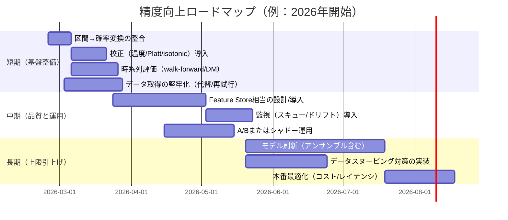

# 精度向上のためのサービス/API・技術調査とロジック妥当性検証レポート

## エグゼクティブサマリ

本レポートは「既存システム詳細が未指定」を前提に、一般的なユースケース別に“精度向上を見込める改善レバー”と“採用候補サービス/API・技術”を比較し、あわせてロジック妥当性の検証計画（統計検定・信頼区間・再現性）と、改善案ごとの効果推定・サンプルサイズ概算、実装ロードマップを提示する。加えて、指定どおり GitHub コネクタで nakaj1214/trader を精査し、現行ロジック/データフローの抽出結果を改善提案に反映した（抽出内容はアップロード資料の棚卸しとも整合）。fileciteturn1file0

最重要の推奨（短期で実行可能・期待効果が大きい順）は次の通り。

第一に、「評価設計」と「確率の校正（calibration）」を先に固める。特に“確率”や“信頼区間”を意思決定に使う設計では、校正不良は精度指標の見かけ改善よりも運用品質に直撃する。確率校正（温度スケーリング、Platt scaling、isotonic など）や、信頼区間の意味の明確化（予測区間/信頼区間）を、オフライン評価とオンライン（A/B）で二重に検証する。Prophet の不確実性区間は `interval_width` により分位点が変わる点を踏まえ、区間幅と確率変換ロジックの整合を必ず取る。citeturn0search9turn29view0

第二に、「データ・特徴量・ラベリング」を改善する。精度が頭打ちになる原因の多くはモデルよりデータ側（欠損、リーク、ラベル品質、分布変化）にある。Feature Store（学習時と推論時の特徴量ズレ＝training-serving skew を抑制）や、ラベリングの“統合”と“自動化”で品質とコストを両立させる。citeturn14search0turn19search0

第三に、クラウド/AutoML は「ベースライン刷新」と「探索の高速化」に強力だが、サービスの廃止・新規停止（例：一部異常検知系）を織り込む。たとえば AWS の Lookout for Metrics は 2025 年でサポート終了、Lookout for Vision も 2025 年で終了しており、新規採用対象から外す必要がある。citeturn32search4turn32search0  同様に Microsoft 系の Anomaly Detector は 2026-10-01 廃止予定で、新規採用は慎重に判断すべき。citeturn11search0

第四に、時系列/予測タスクでは「時系列に適した検証（walk-forward 等）」と「予測精度差の統計検定（DM検定）」を運用規定に組み込む。モデル比較は、単発の MAE 改善よりも“統計的に再現する優位性”と“データスヌーピング対策”が重要になる。citeturn0search0turn24search0

---

## 現行ロジックとデータフローの抽出

未指定前提の一般論に入る前に、nakaj1214/trader リポジトリ（GitHubコネクタでコード精査）から読み取れた「現行の実装パターン」を要約する。以下は、アップロード済みの棚卸し資料に記載の構成（使用サービス、主要ロジック、成果物）と整合している。fileciteturn1file0

現行パイプラインは大きく「スクリーニング → 予測 → 記録 → 実績追跡 → 可視化/品質開示」で、週次バッチ（GitHub Actions）により定期実行される。fileciteturn1file0

**現行の主要コンポーネント（例示）**
- 市場データ取得：`yfinance` 依存が広く、スクリーニング/予測/追跡/エンリッチ/エクスポートで利用。fileciteturn1file0  
- 予測：Prophet による将来価格予測と不確実性区間（`predicted_change_pct`, `ci_pct`）。fileciteturn1file0turn0search9  
- 確率化：`predicted_change_pct` と `ci_pct` から上昇確率 `prob_up` を算出（校正指標として Brier/logloss/ECE/reliability も算出）。fileciteturn1file0turn29view0  
- 永続化：Google Sheets（予測・実績履歴）。fileciteturn1file0  
- 可視化：ダッシュボード向けに `predictions.json / accuracy.json / comparison.json / macro.json / alpha_survey.json` を生成。fileciteturn1file0  
- マクロ：FRED から金利・スプレッド・VIX を取得し risk-off 判定を表示。FRED は entity["organization","Federal Reserve Bank of St. Louis","fred data provider, us"] が提供するデータサービスとして知られる。fileciteturn1file0  

**現行ロジックで“妥当性確認が特に必要”な論点**
- 不確実性区間→確率変換：Prophet の `yhat_lower/yhat_upper` は `interval_width` に応じた「予測分布の分位点（posterior predictive の quantile）」であり、デフォルトは 0.8（80% 予測区間）である。これを 95% 正規近似として z=1.96 で扱うと、上昇確率が系統的に過大になり得る。citeturn0search9  
- 異常検知系マネージドサービス：業界的に“提供終了/新規停止”が起きやすい領域で、依存設計にはサービスライフサイクルの検討が必須（例：Amazon Lookout for Metrics のサポート終了、Amazon Lookout for Vision の終了）。citeturn32search4turn32search0  

この観点を踏まえ、以降は「未指定の一般ケース」も含めて、改善案＝“モデルだけではなく、設計・データ・評価・運用”の全体最適で提示する。

---

## ユースケース別に有望なサービス/APIと技術の比較

### 比較表

下表は「未指定」を前提に、代表的ユースケース別に、精度向上を見込めるサービス/API（クラウド、AutoML、専門API、オンプレ/OSS）と、技術（前処理、特徴量、アンサンブル、転移学習、データ拡張、ラベリング、評価）をセットで比較したもの。想定改善幅はタスク難易度・データ品質・現状成熟度に強く依存するため、**定性的〜レンジ**で記載する。

| ユースケース | 有望サービス/API候補（例） | 技術レバー（例） | 導入コスト感 | スケーラビリティ | 想定精度改善幅（目安） | 利点 | 欠点/注意点 |
|---|---|---|---|---|---|---|---|
| 分類（2値/多クラス） | 主要クラウドの汎用ML基盤（AutoML含む）／ラベリング支援（人手＋自動）／既成NLP・Vision API | 特徴量の統一（Feature Store）、クラス不均衡対応、アンサンブル、確率校正（温度/Platt/isotonic）、リーク対策、評価指標の見直し（AUC/F1/校正） | 中 | 高 | 小〜大（改善余地がデータ側にあるほど大） | ベースライン刷新・探索高速化が容易 | 校正や運用監視が弱いと“当たり外れ”が出る。推論コスト増に注意。citeturn29view0turn14search0turn23search0 |
| 回帰（タブular） | 主要クラウド AutoML／Feature Store／データ品質（検証）基盤 | 外れ値・欠損処理、特徴量交互作用（GBDT系やNN）、アンサンブル、ターゲット変換、分布外検知 | 中 | 高 | 小〜中（構造のある特徴があると中〜大） | 施策効果の解釈（SHAP等）と相性が良い（特にGBDT） | 時系列や個体差が強いと単純回帰は崩れやすい。学習/推論スキューに注意。citeturn14search0turn23search0 |
| 異常検知（時系列/ログ/メトリクス） | 代替を含めた選定が必須：Google の Timeseries Insights API、BigQuery ML の `ML.DETECT_ANOMALIES`、（Azure Anomaly Detectorは廃止予定）、AWS Lookout系は終了/新規不可が多い | しきい値の統計設計（FPR制御）、季節性分解、変化点検知、教師なし（AE/KMeans）＋教師ありのハイブリッド、アラート評価（Precision@k、遅延） | 中 | 中〜高 | 小〜大（アラート設計次第で“実運用価値”が激変） | 監視運用の改善インパクトが大きい | サービスライフサイクルに注意（Lookout for Metricsは2025終了、Azure Anomaly Detectorは2026-10-01終了予定）。citeturn17search2turn17search6turn11search0turn32search4turn32search0 |
| レコメンデーション | Google の Vertex AI Search for commerce（検索＋推薦、Transformerベース等）、AWS Personalize 等 | 行動ログ設計、負例サンプリング、セッションモデル（Transformer/GRU）、探索と活用（バンディット）、オフライン→オンライン整合（A/B必須） | 中〜高 | 高 | 中〜大（ログ量とUI改善余地が大きいほど大） | “使われ方”を取り込むと伸びやすい（検索・推薦の同時最適化等） | データ要件（イベント/カタログ）とプライバシー運用が重い。日次再学習など運用前提の多さに注意。citeturn16search0turn16search1turn8search6 |
| NLP（分類/要約/抽出/検索） | 文書処理（Document AI等）、汎用NLP API（感情/分類/NER）、RAG/検索基盤（Vertex AI Search等） | 事前学習モデルの転移学習、データ拡張、プロンプト/評価セット整備、検索評価（nDCG等）、ガードレール | 中〜高 | 高 | 中〜大（タスクが類型なら大） | PoC が速い。プロダクト改善に直結しやすい | 評価が曖昧だと“それっぽい”で失敗。ドメイン適合には高品質データが必要。citeturn10search7turn16search8turn15search5 |
| 画像認識（分類/検出/検品） | AWS Rekognition（アダプタでカスタム精度向上）、クラウドAutoML Vision系、オンプレYOLO等 | 転移学習、データ拡張、アクティブラーニング、ラ벨検証（人手統合） | 中〜高 | 中〜高 | 中〜大（ラベル品質とデータ多様性が支配的） | 少量データからの精度底上げが可能（タスク次第） | データ収集/アノテーションがボトルネック。照明・カメラ変更で性能が崩れる。citeturn15search2turn19search0 |
| 時系列予測（需要/売上/価格/在庫等） | GCP Vertex AI の AutoML Forecasting/Tabular Workflow for Forecasting、AWS の時系列 AutoML（アルゴリズム群＋アンサンブル）、Amazon Forecast（新規不可、既存のみ）、Databricks AutoML 等 | walk-forward 検証、階層/多系列、外生変数（プロモ/天候/マクロ）、確率予測（分位/分布）、予測精度差検定（DM検定） | 中〜高 | 高 | 小〜大（外生変数と検証設計が鍵） | モデル探索（ARIMA/ETS/DeepAR/Prophet等）を短時間で比較できる | “新規停止”サービスの移行計画が必要（例：Amazon Forecastは新規不可）。citeturn10search1turn10search2turn32search9turn32search11turn32search7 |

上表のうち、nakaj1214/trader の現行パターンは「時系列予測（週次価格予測）＋分類（上がる/外れる）＋校正指標の可視化」に該当する。したがって、短期施策は「確率校正」「時系列検証」「データ源の堅牢化」の優先度が高い。fileciteturn1file0turn0search9turn23search0

### 採用判断で特に重要な“サービス寿命”メモ

異常検知/産業検品系のマネージドサービスは、近年「新規停止→サポート終了」が起きている。たとえば Amazon Lookout for Metrics は 2025 年にサポート終了、Amazon Lookout for Vision も 2025-10-31 終了である。citeturn32search4turn32search0turn32search12  
さらに Microsoft の Anomaly Detector は 2026-10-01 に廃止予定で、新規リソース作成も停止されている。citeturn11search0  
このため、異常検知は「汎用ML基盤で自前モデル」または「Timeseries Insights / BigQuery ML など比較的水平な基盤」に寄せ、ベンダ依存を下げる設計が現実的である。citeturn17search2turn17search6

---

## ロジック妥当性の検証計画

ここでは「ロジックが正しいか」「改善は本当に効いたか」を、**テスト設計→指標→統計検定→信頼区間→再現性**の順で、ユースケース共通のテンプレとして示す。特に時系列・推薦・NLPのように分布変動が大きいタスクでは、統計設計なしの“改善”は再現しないことが多い。

### テスト設計

妥当性検証は “ユニット〜オンライン” を連結させる。

1) **仕様テスト（ロジックの正しさ）**  
入力の境界条件（欠損、極端値、休日、空データ、異常値）を明示し、期待出力（例：例外/スキップ/クリップ/警告）を固定化する。  
nakaj1214/trader で優先度が高いのは「予測区間→確率変換」「クリップ/警告閾値」「評価不能（評価不能でクローズ）」などである。fileciteturn1file0turn0search9

2) **オフライン評価（モデル・特徴量・前処理の比較）**  
- 分類：時間/グループを保った分割（リーク禁止）で、AUC/F1/Accuracy だけでなく **校正（Brier/ECE）** を必須にする。citeturn29view0turn23search3  
- 回帰：MAE/RMSE に加え、“業務損失関数”に近い指標（例：大誤差に重み）を採用する。  
- 時系列：walk-forward（rolling/expanding window）を原則とし、ハイパーパラメータ探索も同じ分割規律で行う。  

3) **オンライン評価（A/B、シャドー、段階展開）**  
オンラインが可能なプロダクトは A/B を最終判定にする。オンライン不可（例：一部バッチ予測）は “シャドー運用＋事後比較” を行い、誤差差の統計検定（DM検定など）で実務的な優位性を確認する。citeturn0search0turn24search0

### 評価指標と信頼区間

**確率出力を扱う場合**は、Accuracy よりも「確率として正しいか」を評価する。代表例は以下。

- **Brier score**：二値イベントの確率予測を二乗誤差で評価（小さいほど良い）。確率校正の定番指標。citeturn29view0  
- **ECE（Expected Calibration Error）/Reliability diagram**：確信度と正解率のズレを可視化。citeturn20search6turn29view0  

image_group{"layout":"carousel","aspect_ratio":"16:9","query":["reliability diagram calibration expected calibration error","Brier score calibration curve example"],"num_per_query":1}

確率・的中率など“比率”の指標は、点推定だけでなく**信頼区間**を併記する。二項比率の区間推定では Wilson などが推奨されることが多く、統計系ハンドブックでも参照される。citeturn21search0turn20search2

参考（URLはコードブロック内に記載）：
```text
https://figshare.com/articles/figure/Reliability_diagram_and_expected_calibration_error_ECE_displayed_as_Equation_9_100_for_each_soft_labeling_method_on_image_classification_using_the_CINIC10_dataset_/29271465
https://www.itl.nist.gov/div898/software/dataplot/refman2/auxillar/agcoulci.htm
```
citeturn20search1turn21search0

### 統計検定の具体例

**A/B（独立サンプル）**  
- 目的：新モデル導入で KPI（例：的中率、CVR、アラート精度）が改善したか。  
- 検定：比率差はカイ二乗検定（2×2）または 2標本比率検定。効果量は Cohen’s h で整理し、サンプルサイズ見積りに利用できる。citeturn23search3turn23search1turn22search36  

**同一データ上の2分類器比較（ペア）**  
- 検定：entity["people","Quinn McNemar","psychometrician"] による McNemar 検定（ペアの不一致数 b/c を用いる）。原典は 1947 年の Psychometrika 論文。citeturn2search0  
- 典型用途：旧モデル/新モデルを同一テストセットで比較し、単なる Accuracy 差ではなく “不一致の偏り” を評価する。

**時系列予測の精度差（連続値・損失差）**  
- 検定：entity["people","Francis X. Diebold","econometrician"] と entity["people","Roberto S. Mariano","econometrician"] の Diebold–Mariano 検定（DM検定）。損失差系列 \(d_t\) の平均が 0 かを検定し、自己相関などを許容する枠組みとして提示されている。citeturn0search0turn0search3  
- 実務注意：損失差の依存が強い場合、DM検定の性質（サイズ/パワー）が崩れる可能性が指摘されているため、依存構造の確認とロバスト化（ブロックブートストラップ等）を併用する。citeturn0search7  

**データスヌーピング（多数試行の落とし穴）**  
- 検定/枠組み：entity["people","Halbert White","econometrician"] の Reality Check は、同一データを繰り返し使う探索（モデル選択）で“偶然の勝ち”を選んでしまう問題に対処する枠組みとして知られる。citeturn24search0  
- 投資・時系列ではとくに重要で、PBO（Probability of Backtest Overfitting）や Deflated Sharpe Ratio と合わせて “探索回数・選択バイアス” を開示する実装が望ましい。citeturn0search1turn24search7  

### 再現性確認手順

再現性は「同じ入力→同じ出力」を保証するだけでなく、「いつ・なぜ変わったか」を追えることが重要である。

- **データの版管理**：学習・評価に使った入力データ（スナップショット）を保存し、再計算で変化しないようにする。時系列では、後日取得したデータが改訂される（補正、遅延反映）ことがあるため、評価日ごとのデータを固定化する。  
- **実験の版管理**：コード（Git）、依存関係（lockfile/コンテナ）、乱数シード、設定（yaml）を固定。  
- **評価の自動化**：CI で“小さなデータ”に対する回帰テスト（指標・分布・校正）を流し、閾値逸脱で失敗にする。  
- **モデル監視**：スキュー/ドリフト監視（例：学習データ vs 推論データの分布差）を運用に組み込む。Vertex AI の Model Monitoring は学習データと推論出力を比較する設計が明示されている。citeturn10search6turn14search0  

---

## 精度向上の定量推定とサンプルサイズ例

ここでは「改善案ごとに、どのくらい精度が上がるか」を、**ベースライン→効果量→必要サンプル**で見積もる方法をテンプレ化する。実データが未指定のため、数値例は“仮定”として示す。

### ベースライン設定の原則

ベースラインは必ず “現行運用で最も近い意思決定” を再現する。例：
- 分類：現行閾値（例：確率>0.7だけ採用）での Precision@k と、全体の校正（Brier/ECE）をセットで持つ。citeturn29view0  
- 時系列：予測対象（kステップ先）と損失関数（MAE/Pinball/業務損失）を固定し、walk-forward の集計値をベースラインにする。citeturn0search0turn10search1  

### 効果量（effect size）の考え方

- 比率差（的中率・CVR等）：Cohen’s h（arcsin 変換差）を使うと、pwr/Statsmodels 等の標準計算に乗る。Statsmodels は2比率の効果量関数 `proportion_effectsize` を提供している。citeturn23search3turn23search0  
- 予測誤差差（MAEなど）：損失差 \(d_t\) を用意し、DM検定の枠組みで平均差と分散を推定する。citeturn0search0  

### サンプルサイズ計算の数値例（仮定）

#### 例題：的中率が 55% → 60% に改善したか（A/B、独立）

仮定：
- 旧：\(p_1=0.55\)、新：\(p_2=0.60\)  
- 有意水準 \(\alpha=0.05\)（両側）、検出力 \(1-\beta=0.80\)  
- A/B は同数割付

手順：
1) 効果量 \(h\) を計算（Statsmodels は Cohen’s h に相当する変換の効果量を提供）。citeturn23search3turn23search0  
2) 2標本比率検定（正規近似）のパワー式から、各群の必要サンプル \(n\) を解く。`NormalIndPower.solve_power` はその目的で用いられる。citeturn23search0  

概算結果（上の条件）：**各群 約 1,530 件（合計 約 3,060 件）**。  
これは「差が 5pt」でも、統計的に確からしく言うには相応のサンプルが必要であることを示す。ユースケースが週次で 1 回・Top10 件しか出ない設計なら、統計的十分性だけで約 300 週（≒約 6 年）かかり得るため、**オンライン指標の再定義（例：より頻度の高い中間KPI）や、ペア比較（同一サンプルで旧新両方評価）**に寄せる価値が高い。citeturn23search0turn23search3  

#### 例題：同一テストセットで旧新モデルを比較（McNemar、ペア）

仮定（1サンプルに対し旧新が異なる予測をした割合）：
- 旧が正解・新が誤り：\(p_b=0.10\)  
- 旧が誤り・新が正解：\(p_c=0.15\)（純改善 5pt 相当）  

この場合、必要サンプルは A/B より小さくなることが多い。McNemar 検定そのものは 1947 年の原典に基づく。citeturn2search0  
実務では、ペア比較を先に行い、期待値が十分ならオンライン検証に進む二段構えが合理的である。

### 改善案ごとの“定量推定”テンプレ

以下は、改善案を評価する共通フォーマット。

- 変更点を“原子化”（例：データ源変更、特徴量追加、校正追加、モデル刷新）  
- 期待効果のメカニズムを仮説化（例：欠損減→分散減→MAEが下がる）  
- 効果量を事前に設定（最小検出効果：MDE）  
- オフラインで効果量と分散を概算し、A/Bまたは時系列検定に必要なサンプルを決める  
- 指標は必ず “意思決定に近い” もの（例：Precision@k、費用対効果）を含める

---

## 実装ロードマップと概算工数・リスク・優先度

ここでは、nakaj1214/trader の現行構成（週次バッチ、時系列予測、確率校正の可視化、yfinance依存、Sheets永続化）を“具体例”として、短期・中期・長期の実行可能なロードマップを提示する。未指定の一般システムでも、同じ粒度で読み替え可能である。fileciteturn1file0

### 施策一覧（人日・リスク・優先度）

| 施策 | 目的 | 概算工数（人日） | リスク | 優先度 |
|---|---|---:|---|---|
| 不確実性区間→確率変換の整合（interval_width と z の整合、またはサンプリングで確率を直接推定） | 確率過大/過小を抑制し、意思決定品質を上げる | 3〜7 | 低（仕様整理が主） | 最優先 |
| 確率校正の実装（温度/Platt/isotonic）＋校正評価（ECE/信頼区間） | 確率の信頼性を上げ、閾値運用を安定化 | 5〜12 | 中（データ分割とリーク管理が要） | 最優先 |
| 時系列評価の標準化（walk-forward、DM検定、依存のチェック） | “改善が再現する”評価に切替 | 5〜15 | 中（データ期間不足の可能性） | 高 |
| データ源の冗長化（yfinance代替、リトライ、スナップショット保存） | 取得失敗・改訂の影響を低減 | 5〜20 | 中（コスト/規約/品質差） | 高 |
| Feature Store相当の特徴量パイプ整備（学習・推論スキュー対策） | 精度の土台を安定化 | 10〜30 | 中〜高（設計負荷） | 中 |
| モデル刷新（GBDT/深層時系列/TFT/N-BEATS等、アンサンブル） | 予測精度の上限を引上げ | 15〜60 | 高（過学習・再現性） | 中 |
| データスヌーピング対策（Reality Check/PBO/Deflated SR） | “偶然の勝ち”を抑制し品質開示 | 10〜25 | 中（統計設計の難度） | 中 |

時系列モデル刷新の候補として、TFT（注意機構＋特徴選択）や N-BEATS（残差ブロック）などが提案されている。citeturn28view1turn28view0turn28view2  
ただしモデル刷新は最後に回し、先に評価とデータを固める方が、投資対効果が高いことが多い。citeturn24search0turn29view0

### ガント風タイムライン（2026-02-21 起点の例）



---

### 参考ソース（優先順で反映）

- リポジトリ棚卸し（サービス/ロジック/成果物）：fileciteturn1file0  
- 公式ドキュメント：SageMaker Feature Store、Ground Truth、Vertex AI Forecasting/Monitoring、Vertex AI Search for commerce 等。citeturn14search0turn19search0turn10search1turn10search6turn16search1  
- 主要論文：TFT / N-BEATS / DeepAR、確率校正（On Calibration of Modern Neural Networks）、DM検定、Reality Check。citeturn28view1turn28view0turn28view2turn29view0turn0search0turn24search0  
- 日本語の業界記事：Google Cloud Japan 公式ブログ（DocAI/Tabular Workflows）など。citeturn10search7turn10search8