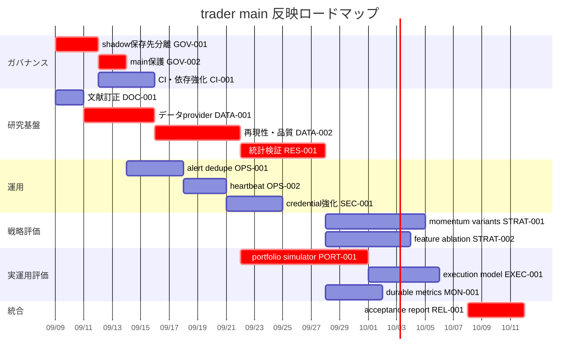
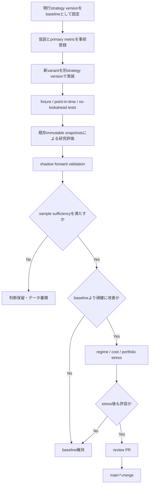

# trader 文献・運用レビュー検証と main 反映実行計画書

## エグゼクティブサマリ

2026年9月8日時点の接続済み GitHub リポジトリ `nakaj1214/trader` の `main`、および指定ファイル `memo/analysis/literature_and_ops_review_2026-09-08.md` を確認し、実装コード、CI/CD、データ取得経路、forward validation、Position Exit Monitor と照合した。現在の `main` はコミット `b2a8d344a8e71623d8921b98414cd930484d7c5d` で、ブランチ保護は有効化されていない。fileciteturn28file0L2-L2

**結論として、対象メモは「方向性は概ね妥当だが、そのまま改善ロードマップとして採用するには重要な抜けがある」**。特に、モメンタムを絶対リターンから相対リターンへ見直すこと、yfinance 単独依存、アラート重複、`STRATEGY_VERSION` 運用などの指摘は有用である。一方で、対象メモには、統計的検証、ポートフォリオ・約定現実性、データ再現性、GitHub ガバナンス、データ利用条件、依存関係のサプライチェーン管理、ジョブの死活監視という、実運用に移る際の重要論点が十分含まれていない。fileciteturn5file0L2-L2

さらに、**文献解釈に一つ重要な訂正が必要**である。メモは Jegadeesh & Titman (1993) を「同業種内の相対順位」でモメンタムを測った研究として扱っているが、同論文が示した中心的結果は過去の個別株 winners を買い losers を売るモメンタム戦略であり、3～12か月の保有期間で正のリターンを報告したものだ。「業種モメンタム」を直接扱う主要論文は Moskowitz & Grinblatt (1999) である。したがって、「Jegadeesh & Titman がそうしているから TOPIX/業種相対リターンへ置換すべき」という論証は修正すべきである。citeturn21search3turn21search0

また、現在コードが使う20日・60日モメンタムは Jegadeesh & Titman の典型的な3～12か月という時間軸より短い。したがって文献は「モメンタムという考え方」の根拠にはなるが、**20日・60日の具体的期間や 3/8/15%、5/15/30% の閾値を直接正当化するものではない**。現行閾値は、固定かつ説明可能ではあるものの、研究上は未較正のハイパーパラメータとして扱うべきである。現行スコアリングの実装は実際にその固定閾値を使用している。fileciteturn17file0L2-L2 citeturn21search3

最優先は**モメンタム式をただちに変更することではない**。先に「どの戦略変更が本当に改善なのか」を判定できる研究・データ・CI のガードレールを作り、現行戦略を baseline として、絶対リターン、TOPIX 超過リターン、クロスセクショナル順位、業種中立化の各案を同じ forward-validation 枠組みで shadow 比較するべきである。金融研究では多数の戦略・因子候補から良い結果だけを選ぶ data snooping / multiple testing によって見かけ上の優位性が生じやすいことが広く問題視されているためである。citeturn7search0turn7search2turn7search3

本調査で追加的に重要と判定した事項は以下である。

| 判定 | 追加結論 |
|---|---|
| **高** | `main` が無保護なのに、shadow scan が `contents: write` で生成データを直接コミット・push している。さらにコミットメッセージに `[skip ci]` がある。戦略改善より先にリポジトリ・ガバナンスを直すべき。fileciteturn14file0L2-L2 fileciteturn28file0L2-L2 |
| **高** | immutable なのは「シグナル snapshot」であり、「評価に用いる将来価格」は rebuild のたびに yfinance から再取得される。後日の訂正・調整方法の変化で過去評価が変わるため、完全な再現性はまだない。fileciteturn24file0L2-L2 fileciteturn29file0L2-L2 |
| **高** | forward validation は mean/median/benchmark beat rate を出すが、信頼区間、サンプル数ゲート、時点間依存への対応、多重検定管理がない。fileciteturn24file0L2-L2 |
| **高** | backtest 自身が `portfolio_interpretation: False` と正しく明記しており、現在の結果をそのまま実ポートフォリオ収益と解釈できない。現金、同時保有数、position sizing、セクター集中、capacity、portfolio drawdown の実装が必要。fileciteturn29file0L2-L2 |
| **高〜中** | yfinance は公式ドキュメント自身が研究・教育目的を想定し、Yahoo Finance API は personal use 向けと注意している。個人研究を超える用途を想定するなら、技術リスクだけでなく利用条件の確認が必要。citeturn22search0 |
| **高〜中** | GitHub Actions の schedule は hard real-time scheduler ではないため、09:03 の monitor を「必ずその時刻に動く売買安全装置」として設計してはいけない。対象コード自身も best-effort と記している。fileciteturn15file0L2-L2 citeturn11search3 |
| **中** | 直接依存は完全 pin されている点は良いが、transitive dependency の lock/hash、dependency review、Dependabot、Actions の full SHA pin がない。fileciteturn11file0L2-L2 citeturn14search0turn13search0turn13search2turn22search15 |

したがって、`main` 反映順序は **「ガバナンス・再現性 → 統計検証 → 運用信頼性 → 戦略A/B → ポートフォリオ現実化」** を推奨する。全改善を実施する場合の概算は **24～36 engineer-days**。主担当エンジニア1名なら約6～8週間、主担当2名を並行投入できれば約4～5暦週を見込む。これは実装・レビュー・テストを含む概算であり、有償データ契約やクラウド基盤新設の調達期間は含まない。

## 対象ファイルと main の現状

指定されたメモは、現在の JP inflection shadow scan と Position Exit Monitor を対象とし、過去レビューの修正確認と、判断ロジックの文献照合を行った文書である。メモ記載では `pytest` 119件 pass、coverage 91.03%、ruff/mypy pass とされている。今回の調査ではコードとワークフローを確認したが、同じ環境で119テストを再実行したわけではないため、この数字は「対象メモに記録された検証結果」として扱う。リポジトリの pytest 設定自体は coverage 80%以上を要求している。fileciteturn5file0L2-L2 fileciteturn11file0L2-L2

**対象メモの主要主張・結論・提案**を整理すると次のとおりである。

| 対象メモの主張 | メモの結論 | 本調査の評価 |
|---|---|---|
| 20日/60日モメンタムが絶対%閾値 | TOPIX/業種相対リターン化が最大の改善候補 | **問題認識は妥当、根拠付けは要修正**。絶対閾値の regime dependency は十分懸念される。ただし Jegadeesh & Titman 1993 を「同業種順位」の根拠とした部分は誤り。TOPIX相対化は候補の一つとして A/B 検証すべき。fileciteturn17file0L2-L2 citeturn21search3turn21search0 |
| 株式分割で volume ratio が歪みうる | 低優先度 | **方向性は正しいが、データ品質項目として昇格余地あり**。価格側は Adj Close、Volume は raw のため、分割をまたぐ20日比較で単純volume ratioが構造的に変化しうる。J-Quants Pro では分割・併合等の corporate action データも提供されており、将来的な正式処理経路がある。fileciteturn18file0L2-L2 citeturn22search10 |
| yfinance 単独依存 | 監視または代替ソースを検討 | **妥当。むしろ重要度を中→高寄りへ引き上げるべき**。データ品質だけでなく利用条件・再現性の問題を含む。fileciteturn18file0L2-L2 citeturn22search0 |
| forward validation artifact を人が見ない | 運用フローが必要 | **妥当。ただし不足**。人の確認だけでなく、自動性能ゲート、dead-man/heartbeat、耐久的履歴保存が必要。現行は90日artifactのみ。fileciteturn13file0L2-L2 citeturn11search1 |
| Position Exit Monitor が同じ stop を1日3回通知しうる | 状態遷移ベースで dedupe | **妥当、優先度を上げるべき**。コード自身も重複を認識しており、Actions runner が ephemeral なため永続状態が必要。fileciteturn21file0L2-L2 |
| Sheets が `clear()`→`update()` | 現状規模なら低優先 | **概ね妥当**。ただし status を他システムが参照するなら中優先へ。2 API call 間の障害で空状態になりうる。fileciteturn20file0L2-L2 |
| 09:03 stop 判定の信頼性が低い | 通知文で慎重に扱う | **妥当。ただし時刻品質以上に scheduler SLA が抜けている**。GitHub Actions schedule 自体を hard real-time とみなさない設計が必要。fileciteturn15file0L2-L2 |
| 52週高値加点 | 文献整合 | **部分的に整合**。George & Hwang は「52週高値価格への近さ」を扱うが、現在のコードは実際の `High` ではなく調整済み `Close` の最大値に対し99%以上という proxy である。文献と完全同型ではない。fileciteturn27file0L2-L2 citeturn21search5 |
| 急騰へのペナルティ | short-term reversal 文献と整合 | **方向性のみ整合**。文献は短期反転現象を支持するが「20日+80%で-6点」という数値は文献から導出されていない。閾値感度分析が必要。fileciteturn17file0L2-L2 citeturn6search0turn6search1 |
| 出来高増を単純加点 | Lee & Swaminathan と緊張 | **メモの警告は重要**。同研究では turnover が momentum の持続性・反転と関連し、高volume winnerはより速く反転する結果があり、「volume増なら常に良い」という単調加点の直接根拠にはならない。citeturn5search5 |
| Trailing stop | 条件付きで妥当 | **妥当**。Kaminski & Lo は stop-loss が常に優位なのではなく、価格過程・momentum regime に依存することを示すため、現在の「検証用アラート」という慎重な位置づけと整合する。citeturn5search9 |
| 売買代金1億円以上 | 流動性文献と整合 | **運用上は妥当だが、Amihud の直接実装ではない**。Amihud ILLIQ は価格変化と dollar volume を組み合わせる指標で、単純売買代金 floor と同一ではない。fileciteturn27file0L2-L2 citeturn8search0 |

現行システムには、メモが評価している以上に良い点もある。シグナル snapshot は暗号化され、strategy/schema version、source commit、market date を検査し、version が混在すると fail closed する。これは point-in-time 検証として非常に良い性質である。fileciteturn24file0L2-L2

backtest も単純な見かけ上のリターンだけではなく、next-open entry、5/20/60営業日の horizon、TOPIX ETF benchmark、same-ticker overlap 除外、10/15/20% trailing stop、base 0.2% と stress 1.2% の往復コスト、MFE/MAE、drawdown を実装している。また、order-book depth、trading halt、制限値幅時の fill probability をモデル化していないことを report に明記している。したがって、対象メモに「execution stress がない」と追加指摘するのは不正確であり、正しくは **「既にコスト stress はあるが、流動性・市場インパクト・制限値幅を数量依存でモデル化していない」** である。fileciteturn25file0L2-L2 fileciteturn29file0L2-L2

一方、`main` の運用状態には対象メモが取り上げていない大きなリスクがある。`inflection_shadow.yml` は `permissions: contents: write` を持ち、定期実行後に生成された encrypted snapshot を checkout 中のリポジトリへ commit/push する。現在の `main` は unprotected である。fileciteturn14file0L2-L2 fileciteturn28file0L2-L2

これに対し、PR CI は既に ruff、mypy、pytest を持っているものの、mypy 対象は production path の一部ファイルだけで、`mypy src` 全体ではない。また `pip install -e ".[dev]"` で毎回依存解決を行い、直接依存は exact pin されているものの transitive lock は確認できない。fileciteturn12file0L2-L2 fileciteturn11file0L2-L2

## 文献・公式資料・競合実装による妥当性検証

ユーザー指定の検証軸を、コードと一次資料で評価した結果は以下のとおりである。

| 検証項目 | 評価 | 根拠と判断 |
|---|---|---|
| **前提の妥当性** | **一部妥当** | 「絶対momentumでは市場全体の影響を拾いうる」という問題提起は合理的。ただし J&T 1993 は業種相対モメンタム研究ではない。また20/60日は同論文の典型的時間軸より短い。絶対→TOPIX相対を結論として固定せず候補比較すべき。citeturn21search3turn21search0 |
| **引用・根拠** | **一部要修正** | 52週高値、volume、stop-loss、liquidity などは関連性の高い文献を選べている。ただし実装閾値そのものを論文が較正したわけではない。また momentum の著者帰属を修正する必要がある。citeturn21search5turn5search5turn5search9 |
| **手法の再現性** | **中程度** | encrypted immutable signal、commit/version metadata は強い。一方、将来価格は rebuild 時に yfinance から再取得され、同じ snapshot + 同じ commit でも provider 側訂正で結果が変わりうる。環境も transitive lock/hash がない。fileciteturn24file0L2-L2 fileciteturn29file0L2-L2 citeturn14search0 |
| **運用上のリスク** | **不足** | alert dedupe と Sheets はメモで認識済み。ただし scheduled job の遅延/欠落を検出する heartbeat、再実行 idempotency、main 直書き、provider error-rate SLO が不足。fileciteturn21file0L2-L2 citeturn11search3 |
| **セキュリティ・コンプライアンス** | **不足** | yfinance 利用条件、無保護 main、長期 service-account JSON、Actions SHA pin、dependency review がメモから抜けている。GitHub は権限最小化と action の SHA pin を推奨する。citeturn22search0turn22search8turn22search15 |
| **スケーラビリティ** | **不足** | 現在は全銘柄の technical scan 後 `deep_candidates=25` のみ J-Quants fundamentals を取得するため効率的だが、技術スコア上位25銘柄という funnel 自体が選択バイアスになる可能性がある。universe→price usable→liquid→top25→fundamental usable の recall を測るべき。fileciteturn27file0L2-L2 |
| **モニタリング・テスト** | **一部妥当** | unit/lint/type/coverage、週次forward validationは存在する。ただし performance CI、confidence interval、minimum sample gate、regime分解、durable history、dead-man alert がない。fileciteturn12file0L2-L2 fileciteturn13file0L2-L2 |
| **データ品質** | **一部妥当** | OHLC整合性、duplicate date、NaN、負volume等はチェック済み。一方、expected TSE session completeness、最終日 freshness、universe coverage、provider間照合、split/corporate action anomaly、異常jump、zero-volume継続を検査していない。fileciteturn19file0L2-L2 |
| **依存関係管理** | **不足** | direct dependency pin は良いが transitive dependency lock/hash がない。pip は repeatable installation に hash を利用でき、GitHub は dependency review/Dependabot を提供している。fileciteturn11file0L2-L2 citeturn14search0turn14search11turn13search0turn13search2 |

**モメンタムについての正しい改善仮説**は、「相対リターンに変える」と最初から決めることではなく、次の4変種を固定した研究プロトコルで比較することである。

| Variant | 定義 | 目的 |
|---|---|---|
| baseline | 現在の20d/60d absolute return | 現行戦略を凍結した control |
| market-relative | `stock_return - TOPIX_return` | 市場 beta 的な全面高を除去 |
| cross-sectional | 同日の対象 universe 内 percentile/rank | winners/losers の相対的位置を見る |
| industry-neutral | 業種平均または業種 percentile からの超過 | industry momentum と individual momentum を分離 |

Jegadeesh & Titman は winner/loser のクロスセクショナルなモメンタムを支持し、Moskowitz & Grinblatt は industry momentum が individual-stock momentum の多くを説明しうることを示しているため、上記のように分解して検証する方が文献に忠実である。citeturn21search3turn21search0

52週高値についても、現実装は `Close` の約52週最大値の99%以上を breakout としているが、George & Hwang の概念は「current price と 52-week high price の距離」である。したがって `High` ベースの `distance_to_52w_high` を連続変数として追加し、現在の bool proxy と比較するのが望ましい。fileciteturn27file0L2-L2 citeturn21search5

**統計検証は対象メモ最大の漏れの一つである。** 現在の `summarize_benchmark_excess()` は evaluated count、mean/median excess return、benchmark beat rate を返すが、それらの不確実性を表示しない。fileciteturn24file0L2-L2 同じ市場日に複数銘柄シグナルが発生する場合、それらを完全に独立な観測として扱うのは過度に楽観的になり得る。実装案としては、signal date をクラスタとして再標本化する block/stationary bootstrap による95% confidence interval、あるいは時系列依存を意識した HAC（heteroskedasticity and autocorrelation consistent）推定を検討できる。Newey-West HAC と stationary bootstrap は、それぞれ自己相関・不均一分散や弱依存系列を扱うための確立された手法である。citeturn18search0turn18search3

加えて、momentum閾値、volume閾値、52週高値、trailing stop、holding period、cost など多数の候補を同じデータ上で反復して調整すると、最良に見えた設定を選んだだけで「改善」が生じる。金融因子研究では conventional な有意性水準では多数検定に不十分になり得ることが指摘されており、研究パラメータを strategy version ごとに事前登録してから shadow forward evaluation へ送る仕組みが重要である。citeturn7search0turn7search2

**ポートフォリオとexecutionの不足も重要**である。現在のコードは同一 ticker の重複を排除するが、異なる銘柄を何銘柄同時に保有できるか、現金残高、position sizing、セクター上限、売買代金に対する注文比率をモデル化していない。さらに report 自身が `portfolio_interpretation: False` としているので、設計意図としてもまだ portfolio backtest ではない。fileciteturn25file0L2-L2 fileciteturn29file0L2-L2

競合・業界実装を見ると、QuantConnect LEAN は fee/slippage/buying-power の「reality models」を分離して backtest に入れる設計を採り、NautilusTrader も backtest fill/slippage/liquidity のモデル化を明示的に扱う。これは本プロジェクトをそれらへ移行すべきという意味ではなく、**戦略ロジックとは別に execution reality layer を持つ**という設計パターンが成熟した trading engine では一般的であることを示している。citeturn17search3turn17search5turn17search0turn16search5turn16search12

データ面では yfinance だけに依存し続ける必要性は低下している。JPX は2025～2026年に J-Quants / J-Quants Pro を拡充し、J-Quants Pro では株価四本値や corporate actions、API/SFTP/Snowflake 経由の法人向けデータを提供している。個人向け J-Quants API V2 も2025年12月に開始され、2026年1月にはCSVと分足/Tickデータが追加されている。citeturn22search12turn22search10turn22search5 現在のリポジトリには既に J-Quants V2 client があり、rate-limit/retry/pagination も実装済みだが、現状メソッドは上場銘柄と financial summary に限定される。したがって price adapter を拡張することはアーキテクチャ上自然である。fileciteturn23file0L2-L2

ただし、J-Quants の個人向け/法人向けプランには用途区分があるため、「yfinanceからJ-Quantsへ切り替えればライセンス問題が自動的に消える」と考えるべきではない。例えば2026年に追加された TDnet add-on は個人投資家向けで、法人・学術用途には使用できない旨がJPXから明示されている。プロジェクトの利用主体が未指定なので、**personal research / 法人内部利用 / 外部サービス提供のどれかをまず明記し、それに合わせたデータ契約を確認する**のが正しい手順である。citeturn22search1turn22search11

## 漏れ・抜けと優先改善項目

以下は、対象メモにはない、または重要度が過小評価されている改善項目である。工数は「既存コードを保ったまま段階的に改善する」前提で、調達・有償契約審査を除く。

| 改善項目 | 漏れ・問題 | 優先度 | 推定工数 | 推奨対応 |
|---|---|---:|---:|---|
| **main 保護と自動直書き廃止** | `main` が unprotected。一方 shadow workflow が `contents:write` で直接push。fileciteturn14file0L2-L2 fileciteturn28file0L2-L2 | **高** | 4～8時間 | snapshot 保存先を別 data branch / durable store へ移し、main はPRのみ、required checks を設定 |
| **文献訂正・研究仮説台帳** | J&T 1993 の業種順位という記述が誤り。戦略変更の事前仮説管理もない。citeturn21search3turn21search0 | **高** | 4～8時間 | memo訂正、各strategy versionに hypothesis / primary metric / acceptance rule を記録 |
| **統計的 confidence interval** | mean/median/beat rate の点推定だけ。fileciteturn24file0L2-L2 | **高** | 2～3日 | date-cluster/block bootstrap、95% CI、minimum evaluated dates/signals、regime別評価 |
| **multiple-testing対策** | 多数の閾値・stop・期間を比較するとdata snoopingの危険 | **高** | 1～2日 | variant registry、変更回数記録、holdout/forward-only acceptance、検定補正方針 |
| **outcome data の固定化** | signal snapshot はimmutableだが評価価格は毎回再取得。fileciteturn29file0L2-L2 | **高** | 2～4日 | source/date/hash付き outcome snapshot、または licensed/versioned provider cache |
| **データ品質SLO** | 現行 validator に freshness/completeness/coverage/reconciliation がない。fileciteturn19file0L2-L2 | **高** | 1.5～3日 | TSE calendar completeness、latest-date lag、coverage%、split anomaly、cross-source sample reconciliation |
| **yfinance 利用条件・代替provider** | 技術依存だけでなく personal-use 条件の整理が必要。citeturn22search0 | **高※** | 2～5日 | 用途確認、provider interface、J-Quants daily-price adapter/cross-check、fallback policy。※個人研究のみならコンプラ優先度は中 |
| **portfolio simulator** | 現評価は明示的に portfolio interpretation ではない。fileciteturn29file0L2-L2 | **高** | 4～7日 | cash、position sizing、最大同時保有、sector cap、turnover、equity curve、portfolio DD |
| **流動性・約定モデル** | 固定0.2/1.2% stressはあるが注文サイズ依存なし | **高〜中** | 2～4日 | spread/participation/slippage、limit-down/no-fill、halt scenarios |
| **Position Monitor dedupe** | breachが続けば同一tickerを各実行で通知。fileciteturn21file0L2-L2 | **高〜中** | 1～2日 | persistent alert state、`normal→triggered` の状態遷移時だけ通知、recoveryも記録 |
| **scheduler heartbeat/dead-man** | GitHub schedule の遅延/未実行を現在検出できない | **高〜中** | 1～2日 | expected-run deadline、last-success timestamp、missed-run alert。hard SLA が必要なら後続で scheduler 移行 |
| **durable validation history** | forward summary artifact は90日保持のみ。fileciteturn13file0L2-L2 | **中** | 1～2日 | aggregate metrics の長期保存先を導入し、versionごとの時系列を残す |
| **dependency reproducibility** | direct pin は良いが transitive lock/hash なし | **中** | 1～2日 | constraints/lock + hashes、非editable CI install、更新bot |
| **GitHub supply-chain hardening** | action refs が `@v7` tag で、main required checks なし | **中〜高** | 0.5～1日 | full-length SHA pin、minimal permissions、Dependency Review、Dependabot。GitHubはSHA pinをサポート・推奨。citeturn22search8turn22search15 |
| **Google credential短命化** | `GOOGLE_SERVICE_ACCOUNT_JSON` というlong-lived keyをSecretに保持。fileciteturn15file0L2-L2 | **中** | 1～3日 | WIF/OIDC の feasibility spike。Google GitHub Action は WIF を service-account key より推奨。gspread との認証経路を実証後移行。citeturn23search5 |
| **score component ablation** | fixed weightsが説明可能だが各componentのincremental value未検証 | **中** | 2～4日 | momentum/volume/52w/fundamentalを1つずつ外す ablation、regime別寄与 |
| **52週高値featureの厳密化** | 実装はAdjusted Close max×99%、論文は52-week high priceへの距離 | **中** | 0.5～1日 | `distance_to_52w_high`、Highベースproxy、現行boolとの比較 |
| **volume の非単調化検証** | volume↑を常に加点しており文献含意と単純一致しない | **中** | 1～2日 | volume×return interaction、極端高volume penalty、ablation |
| **preselection recall監査** | fundamentals取得がtop25 technical候補のみ | **中** | 2～4日 | cache利用の定期full-universe audit、top25で取り逃す候補を測定 |
| **split volume処理** | 現行 scanner で actions=False、raw volume ratioがsplitを跨ぐ | **中〜低** | 0.5～1.5日 | corporate action取得、split日を含むwindow無効化またはvolume正規化 |
| **Sheets status 更新耐障害性** | `clear()`→`update()` の途中失敗で一時的に空 | **低〜中** | 4～8時間 | staging/一括更新、last-good snapshot、update failure test |
| **STRATEGY_VERSION / key rotation runbook** | メモ既出だが実運用ドキュメント未整備 | **中** | 4～8時間 | version切替、snapshot隔離、encryption key rotation、rollback手順 |

特に、対象メモが「最重要」とした相対モメンタム化より先に、**main保護・再現可能なデータ・統計評価基盤**を入れるべきである。そうしないと、相対モメンタムに変更した結果が良く見えても、それが本当に改善か、provider改訂や試行錯誤による偶然かを区別しづらい。

また、税率20.315%については、2026年時点の標準的な課税口座における上場株式譲渡益の税率として対象メモの数値は実務上妥当だが、NISA等の非課税口座や損益通算が存在するため、全利用者の実効税率として扱うべきではない。現在の forward validation が `apply_tax=False` をデフォルトにしているのは、戦略そのものの税引前優位性を見る上では合理的である。fileciteturn29file0L2-L2 citeturn20search2turn19search8

## main 反映の実行計画

**目的**は、対象メモの妥当な指摘を取り込みつつ、単なる戦略パラメータ変更ではなく、`main` を「変更の効果を再現可能かつ安全に判定できる状態」へ引き上げることである。

**スコープ**は `src/strategy/`、`src/data/`、`src/evaluation/`、`src/monitoring/`、`scripts/`、`.github/workflows/`、`memo/`、依存管理ファイル、および GitHub repository settings とする。broker API による自動発注、本番資金投入、新しい有償データ契約の締結は本計画のスコープ外とし、必要性の判定までを含める。

**前提**として、担当人数は未指定なので「SWE/Platform担当1名 + Quant/Reviewer担当1名を並行投入可能」と仮定する。1名体制の場合は同じチケットを順番に実施する。現在のCIはGitHub Actions、データ取得は yfinance + J-Quants、状態共有はGoogle Sheets、通知はSlackという現行構成を可能な限り維持する。fileciteturn9file0L2-L2

**成果物**は、訂正版研究レビュー、strategy hypothesis registry、main protection、再現可能なデータ品質層、統計的forward-validation、alert state、portfolio/execution simulator、CI security強化、運用runbook、最終 acceptance report とする。

チケット単位の実行計画は以下のとおり。

| Ticket | タスク | 主担当想定 | 依存 | 優先度 | 見積り | 完了条件 |
|---|---|---|---|---:|---:|---|
| **GOV-001** | shadow snapshot の main 直pushを廃止し、保存先をdata branchまたは外部durable storeへ分離 | Platform | なし | 高 | 1日 | schedule実行でmainにcommitが発生しない |
| **GOV-002** | main branch protection/ruleset、required CI、direct push禁止 | Maintainer | GOV-001 | 高 | 0.5日 | main変更はPR経由のみ、required checks failureでmerge不可 |
| **DOC-001** | literature review訂正、J&T/Moskowitz分離、heuristic threshold明記 | Quant | なし | 高 | 0.5～1日 | memoに一次文献と「直接根拠/間接根拠/heuristic」を明記 |
| **CI-001** | full SHA action pin、Dependency Review、Dependabot、lock/hash、通常install | Platform | GOV-001 | 中〜高 | 1～2日 | clean runnerで同一lockからinstall、vulnerable PR gate動作 |
| **DATA-001** | `MarketDataProvider` 抽象化、yfinance/J-Quants adapter、cross-check | Data/SWE | DOC-001 | 高 | 2～4日 | fixtureでprovider交換可能、差分測定report生成 |
| **DATA-002** | freshness/completeness/corporate-action/coverage validation と outcome snapshot/hash | Data/SWE | DATA-001 | 高 | 2～4日 | 同一source snapshotで再実行結果がdeterministic |
| **OPS-001** | Position Monitor のpersistent alert state + idempotent notification | SWE | なし | 高〜中 | 1～2日 | 同一breachを3回実行してもalertは1回、recovery後の再breachは再通知 |
| **OPS-002** | scheduler heartbeat、provider error metrics、missed-run通知 | Platform | OPS-001 | 高〜中 | 1～2日 | expected deadline超過を自動検知 |
| **RES-001** | block/bootstrap CI、minimum-N、regime breakdown、research registry | Quant/SWE | DATA-002 | 高 | 2～4日 | mean excess return等にCI、sample sufficiencyを出力 |
| **STRAT-001** | absolute / TOPIX-relative / cross-sectional / industry-neutral momentum A/B | Quant | RES-001 | 高 | 3～5日 | baselineを上書きせず各variantを別strategy_versionで比較 |
| **STRAT-002** | 52w exact feature、volume interaction、extreme-runup sensitivity、ablation | Quant | RES-001 | 中 | 2～4日 | 各componentのincremental valueと感度表が生成 |
| **PORT-001** | cash/position-size/concurrency/sector/capacity portfolio simulator | Quant/SWE | DATA-002 | 高 | 4～7日 | equity curve、turnover、CAGR/volatility/maxDD、exposureを出力 |
| **EXEC-001** | spread/participation/slippage/limit-down no-fill stress | Quant/SWE | PORT-001 | 高〜中 | order size依存costとstop fill sensitivityをreport |
| **MON-001** | aggregate forward metricsを90日超で保持するdurable history | Platform | RES-001 | 中 | strategy_versionごとの長期時系列が復元可能 |
| **SEC-001** | Google SA JSON→WIF feasibility、key rotation、secret inventory/runbook | Platform | GOV-002 | 中 | WIF実証または非対応理由を記録し、key rotation手順完成 |
| **REL-001** | acceptance report、baseline比較、release/rollback手順 | Reviewer | 全重要ticket | 高 | 1～2日 | merge可否と未解決riskを文書化 |

GOV-001 の保存先については、**現時点で「public data branch」が最適と断定しない**。暗号化されていても、データ利用条件・履歴保全・key rotationとの整合を確認してから、専用branch、Google Cloud Storage等のobject store、その他のdurable storageから選ぶべきである。J-Quants には利用区分があるため、公開repositoryへのデータ保存可否も用途契約と合わせて確認する。citeturn22search11turn22search12

推奨タイムラインは次のとおりである。2名並行を想定している。



この順番のポイントは、**STRAT-001 を DATA-002 と RES-001 の後ろに置くこと**である。新しい relative momentum を先に実装して過去結果を見ながら閾値調整すると、意図せず overfitting を促す。先に評価手続きを固定してから variant を投入する。citeturn7search0turn7search3

戦略変更の判断フローは次のようにする。



ここで「baselineより改善」の acceptance criterion は単一の平均returnだけにしない。最低限、5/20/60日での excess return の confidence interval、median、benchmark beat rate、最大drawdown、base/stress cost、bull/bear・高/低volatility regime、十分なmarket-date数を併記する。特定のvariantを採用する閾値そのものは過去データを見た後に自由に決めず、RES-001で事前に固定する。

## CI/CD・テスト・レビューとマージ基準

現在の CI は `pull_request -> main` で ruff、部分的mypy、pytestを実行し、pytest設定には80% coverage gateがある。これは良い基礎である。fileciteturn12file0L2-L2 一方、`main` が保護されていないため、「CIが存在する」ことと「CIを通らない変更をmainへ入れられない」ことが一致していない。ここをまず揃える。fileciteturn28file0L2-L2

**推奨CI/CD構成**は次のとおり。

| Pipeline | 実行タイミング | 必須内容 | merge gate |
|---|---|---|---|
| **Fast CI** | 全PR | ruff、`mypy src scripts`、unit tests、coverage | 必須 |
| **Data Contract CI** | data/provider変更PR | recorded provider fixture、schema drift、split/missing-session/stale data tests | 必須 |
| **Dependency Security** | 全PR | GitHub Dependency Review、lock integrity | 必須 |
| **Strategy Regression** | strategy/evaluation変更PR | deterministic golden fixtures、no-lookahead regression、baseline output diff | 必須 |
| **Research Evaluation** | strategy変更PR + manual | fixed historical snapshotでvariant比較。インターネット依存させずcached data使用 | strategy PRで必須 |
| **Forward Validation** | 週次 | current live snapshots、benchmark/stress、CI、sample-size、regime metrics | データ/コード failureはalert。performanceのみを早期にmerge blockerにはしない |
| **Position Monitor Health** | 各schedule + watchdog | last-success、runtime、provider freshness、dedupe state | SLA violation時alert |
| **Dependency Updates** | 定期 | Dependabot PR + full CI | 通常PRと同じ |

GitHub は Actions の token permissions を明示的かつ最小化し、第三者 Actions は full commit SHA へ pin することを推奨している。また repository-level policy で GitHub-authored actions を含め full-length SHA pin を強制することもできる。citeturn22search8turn22search15 現在の workflow は `actions/checkout@v7`、`actions/setup-python@v7`、`actions/upload-artifact@v7` と tag を利用しているため、CI-001 で既知SHAへ固定する。fileciteturn12file0L2-L2 fileciteturn13file0L2-L2

依存関係については、現在 `pyproject.toml` でtop-level packagesを exact version pinしている点は評価できる。しかし `pip install -e ".[dev]"` はその時点のresolverでtransitive dependencyを解決するため、「同じtop-level pinなら将来も同一環境」とは限らない。pip の repeatable installs では hash checking を使えるため、lock/constraints と hashes をCI入力として固定する。CIでは editable install ではなく通常installも実行し、実際のpackagingを検査する。fileciteturn11file0L2-L2 citeturn14search0turn14search6turn14search11

**テスト acceptance criteria** は以下とする。

| 対象 | merge必須基準 |
|---|---|
| 一般品質 | ruff 0 error、mypy対象全コードpass、pytest pass |
| Coverage | global 80%以上を少なくとも維持。単純に数字だけを91%以上へ引き上げるのではなく、strategy/data/evaluation変更箇所には成功・失敗・boundary pathを追加 |
| Strategy | fixed fixtureで同strategy_versionの結果がbit-levelまたは許容丸め内でdeterministic |
| Point-in-time | signal date以後に公開されたfundamental/corporate actionをfeature生成へ混入させないテスト |
| Momentum | baseline、market-relative、cross-sectional、industry-neutralを同一inputから再現可能 |
| Data quality | missing TSE session、stale last date、duplicate、NaN、zero/negative volume、split、cross-provider mismatchを検出 |
| Outcome provenance | evaluation reportにprovider/version/as-of/hashを必須出力 |
| Statistics | bootstrap seed固定test、known synthetic distribution test、insufficient sample時に「有意」と判定しない |
| Portfolio | cash conservation、position cap、同時保有限度、size計算、sector cap、no-fill時に架空約定しない |
| Exit | gap through stop、limit-down/no-fill、same-day HWM orderingを明示fixture化 |
| Alerting | 同一breachを3回実行してSlack通知1回、normal復帰後の新breachは再通知 |
| Workflow | rerunがidempotentで、同一market dateのduplicate stateを作らない |
| Security | write permissionを必要なjobだけに限定、secret値がartifact/logに残らない |

forward validationについては、現在5/20/60日、TOPIX ETF benchmark、base/stress transaction cost、trailing stop variantを持つので、これを捨てずに拡張する。fileciteturn29file0L2-L2 具体的には output schema に次を追加する。

```text
strategy_version
evaluation_data_snapshot_id
price_provider
price_data_hash
evaluated_signals
evaluated_market_dates
mean_excess_return
mean_excess_return_ci95
median_excess_return
beat_benchmark_rate
bull_regime_summary
bear_regime_summary
high_volatility_summary
low_volatility_summary
portfolio_summary
execution_stress_summary
research_hypothesis_id
```

**レビュー・マージ手順**は、次の運用を推奨する。

1. GOV-001 のみは main 保護を有効化する前に、既存の自動直書きとの依存関係を解消する。shadow schedule を短期間 manual-only にするか、保存先分離PRを最優先でmergeする。
2. GOV-001 後に main protection を有効化し、以後 direct push を禁止する。GitHub の protected branch / ruleset では required status checks とレビュー条件を設定できる。citeturn12search0
3. 以降は ticket ごとに小さいPRを作る。strategy変更とdata-provider変更を同一PRに混ぜない。
4. PR description に「目的、仮説、変更前baseline、変更後、影響データ、rollback」を必須化する。
5. strategy PR はコードレビューに加え、Quant reviewer が「研究手続きが事前登録どおりか」を確認する。
6. merge方式は squash/rebaseのどちらかに統一し、`source_commit_sha` から評価コードを追跡できる状態を保つ。
7. merge後は少なくとも1回 shadow run を確認し、production alert pathに異常がなければ完了扱いとする。
8. empirical performance が期待を下回っても、研究・データ・CI改善自体は rollback しない。戦略variantのみ baseline へ戻せる構成にする。

担当者が一人だけの場合、「必須reviewer 1名」をGitHub設定で強制すると自分自身のPRをmergeできなくなる可能性がある。その場合は reviewer必須を設定せず required status checks + conversation resolution を強制し、戦略変更だけ外部レビューを受ける運用を現実解とする。担当人数が未指定のため、これは運用条件によって選択する。

Google Sheets については、現在 long-lived service account JSON がGitHub Secretから渡される。fileciteturn15file0L2-L2 Google の `google-github-actions/auth` は長期 service-account key をexportしない Workload Identity Federation を推奨しているため、SEC-001 で gspread/Sheets API と合わせた小規模実証を行う価値がある。直接移行可能と断定せず、まず GitHub OIDC → service-account impersonation → Google Sheets API 呼び出しまでをテストし、成功した場合に既存JSON keyをrevocationする。citeturn23search5

## 前提・リスク・最終判定

本計画は次の仮定に基づく。

| 未指定事項 | 本計画での仮定 |
|---|---|
| 担当人数 | SWE/Platform 1名 + Quant/Reviewer 1名を基本。1名でも実行可能 |
| 利用目的 | 現時点では個人研究か商用か不明。データ利用条件は確定前提にしない |
| 資金運用 | 現在はshadow/researchで、自動発注はスコープ外 |
| CI | GitHub Actionsを継続 |
| クラウド | Google関連credentialはあるが、新規GCP infrastructureは未確定 |
| データ契約 | 現在のJ-Quants設定を維持。J-Quants Pro導入は必要性評価まで |
| 本番SLA | Position Monitorは現状best-effort。hard trading SLAは未設定 |

特に「プロジェクトが個人研究なのか、法人内部利用なのか、外部サービス提供なのか」はセキュリティ・データ契約の重要な分岐となる。yfinance は research/educational、Yahoo Finance API は personal use 向けとドキュメントに明記されている一方、JPX は個人向け J-Quants API と法人向け J-Quants Pro を分けている。したがって、商用化を想定する時点で provider suitability を再審査する必要がある。citeturn22search0turn22search12

主要リスクと緩和策は以下のとおり。

| リスク | 影響 | 緩和策 |
|---|---|---|
| main保護を先に有効化してshadow pushが失敗 | 日次snapshot欠損 | 先にGOV-001で保存先分離、その後GOV-002 |
| relative momentumへ変更して性能悪化 | シグナル品質低下 | baselineを削除せずstrategy_version分離、shadow A/B |
| variantを多数試しoverfit | 偽の改善 | research registry、primary metric固定、forward-only acceptance、多重検定管理 |
| yfinance/J-Quantsで値が食い違う | 評価不定 | source provenance、tolerance、sample reconciliation、manual escalation |
| outcome providerの後日修正 | 過去reportが変わる | immutable/hash付き評価price snapshot |
| forward sample不足 | CIが極端に広い | 「有意差なし」と「劣る」を区別し、minimum-Nまで判断保留 |
| portfolio model導入で従来alpha消失 | 見かけの戦略性能低下 | それ自体を重要な発見と扱い、trade-level metricは参考値に格下げ |
| GitHub schedule遅延 | stop alertの遅延 | heartbeat。hard SLAが必要なら Cloud Scheduler/Cloud Run 等の dedicated scheduler を別途評価 |
| WIF移行失敗 | Position Monitor停止 | dual-pathで実証し、成功確認後のみ旧key revoke |
| CIが重くなる | 開発速度低下 | fast deterministic PR CI と週次network/research jobを分離 |

最終的な対象メモの評価は次のとおりである。

| 観点 | 最終判定 |
|---|---|
| 問題発見能力 | **良好** |
| コードとの整合 | **概ね良好** |
| 金融文献との整合 | **概ね良好だが重要な引用訂正あり** |
| 閾値の学術的正当化 | **不足** |
| 再現性 | **シグナル側は良好、outcome側は不足** |
| 統計的検証 | **不足** |
| execution / portfolio | **不足** |
| 運用設計 | **一部不足** |
| セキュリティ・GitHubガバナンス | **大きな抜けあり** |
| データ品質・ライセンス | **大きな抜けあり** |
| 依存管理 | **中程度の抜けあり** |
| main改善計画としての完成度 | **改訂後に採用すべき** |

したがって、対象メモにある「**絶対モメンタムを相対モメンタムへ変更することが最大の優先事項**」という結論は、そのままでは採用しないのが妥当である。より正確には、

> **最優先は、戦略変更を正しく評価できるガードレールを構築すること。その後、絶対・TOPIX相対・クロスセクショナル・業種中立モメンタムを事前定義した条件で比較し、forward evidence が十分な場合のみ採用する。**

という形へ修正するのがよい。

現在の `trader` は、point-in-time snapshot、strategy/schema version、benchmark-aware forward validation、transaction-cost stress、明示的に portfolio interpretation を拒否する設計など、研究システムとしてかなり良い土台を既に持っている。fileciteturn24file0L2-L2 fileciteturn29file0L2-L2 次の改善フェーズでは、新しいシグナルを増やすことよりも、**「同じデータなら同じ結論になる」「偶然の改善を採用しない」「CIを迂回してmainが変わらない」「データ提供元の異常を検知できる」「alertが必要な時だけ一度届く」「trade-levelの良さがportfolioでも残る」**状態を作ることが、プロジェクト全体の信頼性と将来の戦略改善効率を最も大きく引き上げる。