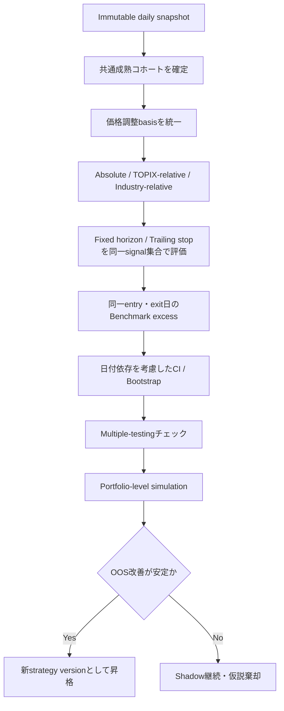

# `trader` プロジェクト文献・運用レビューの妥当性検証と追加改善調査

## エグゼクティブサマリ

対象ファイル `memo/analysis/literature_and_ops_review_2026-09-08.md` は、接続済みGitHub上の `nakaj1214/trader` リポジトリに実在し、内容を確認できた。ファイルは2026年9月8日、コミット `b2a8d344a8e71623d8921b98414cd930484d7c5d`（author/committer: `nakaj1214`、07:31:16 UTC＝16:31:16 JST、メッセージ「現状の問題点」）で新規追加されている。ファイル自体のSHAは `84e1d5f37c0c9252498b2bcaa7176ba6e93f7b72` である。確認できたパス履歴上、このファイルは同コミットで追加された新規文書であり、後続改訂は確認できない。fileciteturn4file0L1-L13 fileciteturn2file0L3-L6

**総合判定は「改善レビューとして有用だが、現状のままプロジェクトの優先順位を決める根拠として使うには重要な補正が必要」**である。コード上の事実認識、とくに絶対リターン型モメンタム、yfinance依存、重複Slack通知、Google Sheetsの `clear()`→`update()`、strategy version切替runbook不在といった指摘は概ね正しい。fileciteturn2file0L2-L2 一方、学術文献との対応づけには「方向性が似ている」ことを「実装への直接的な裏付け」と評価している箇所が複数あり、特に Jegadeesh & Titman (1993)、George & Hwang (2004)、Lee & Swaminathan (2000)、Kaminski & Lo (2014)、Amihud (2002) の解釈は強すぎる。citeturn14search3turn14search0turn14search7turn14search10

さらに重要なのは、対象レビューが見落としている問題の中に、レビュー自身が「最重要」とする相対モメンタム化より先に検証すべきものがあることである。特に以下の四点は**高優先度**と判断する。

| 重要な追加発見 | 評価 |
|---|---|
| **Trailing Stop forward validation の未成熟コホート・右打切りバイアス** | 最重要。60営業日が経過していない最近のシグナルについて、早期にstopしたケースは「完了」として集計できる一方、stopせず保有継続中のケースは未完了になる実装であり、直近コホートのtrailing-stop成績を下方に歪め得る。共通の成熟日を経たシグナルだけで比較すべき。fileciteturn13file0L2-L2 fileciteturn22file0L2-L2 |
| **backtestと本番monitorの価格調整基準が一致していない** | Forward validation は `auto_adjust=True`、本番Position Monitorは `auto_adjust=False` でsplitのみ手動補正している。yfinance自身の説明ではYahoo価格はsplit調整済みで、`auto_adjust` は `Adj Close` を使って配当調整をOHLCへ適用する。このため「split_adjusted_ohlc」というforward reportの記述と実装に不整合がある。fileciteturn21file0L2-L2 fileciteturn22file0L2-L2 citeturn8search12turn8search13 |
| **日本株におけるモメンタムの外的妥当性が未検討** | Fama & French (2012) は北米・欧州・日本・アジア太平洋を比較し、リターン・モメンタムは「日本を除き」観察されたと報告している。米国研究だけから「日本株でも相対モメンタム化すべき」と結論するのは不十分で、現行absolute、TOPIX-relative、industry-relativeを日本株データで競わせるべき。citeturn6search8 |
| **統計的有意性・多重探索・ポートフォリオ実装可能性の評価が不足** | 現行forward reportは平均・中央値・勝率・profit factor等を計算するが、信頼区間、多重テスト補正、日付/銘柄間依存の処理、portfolio-wideの資金制約を持たない。複数horizon・複数stop幅を比較する以上、data snooping対策は重要である。fileciteturn13file0L2-L2 fileciteturn22file0L2-L2 citeturn9search0turn9search17 |

したがって、対象ファイルの「**モメンタムをTOPIX/業種相対化することが最大のギャップ**」という結論は、**実装候補としては妥当だが、最優先で本番ロジックを変更する結論としては時期尚早**である。fileciteturn2file0L2-L2 先に評価パイプラインの打切りバイアス、調整価格の意味統一、統計的評価を是正し、その上でabsolute / TOPIX-relative / industry-relativeを同じpoint-in-timeデータで比較する順番がより堅牢である。これは上記コードと文献を組み合わせた本調査の推論である。citeturn6search8turn6search0turn9search0

また、対象ファイルに記載された「pytest 119 passed、coverage 91.03%、ruff/mypy PASS」について、直前のコードコミットに対するGitHub Actionsでは regression suite と lint/type-check のjobがいずれも成功していることを確認した。対象ファイル追加コミットは文書のみの変更であるため、コード状態はそのCI対象と同じである。ただし、取得できたActions jobメタデータにはテストログ本文が含まれず、**119件・91.03%という正確な数字までは本調査から独立再計算していない**。fileciteturn23file0L1-L2 fileciteturn25file0L1-L13

## 対象ファイルの内容と調査方法

### ファイルが提示している仮説・結論

対象文書は、既存レビューで指摘された問題が修正済みという前提に立ち、現在残っているコード・運用上の問題と、スコアリングおよびExit戦略の金融文献上の妥当性を再評価している。fileciteturn2file0L2-L2

主要内容を整理すると次のようになる。

| 項目 | 対象ファイルの内容 |
|---|---|
| 主要仮説 | 現行20日・60日momentumは絶対リターン閾値であるため、個別株固有のシグナルと市場ベータを分離できていない。 |
| 主結論 | TOPIXまたは業種平均との差による相対momentumへ変更し、市場レジーム別forward validationを行うことが最重要。 |
| その他のコード課題 | 株式分割によるVolume歪み、yfinance単独依存、`STRATEGY_VERSION` 切替runbook不足。 |
| 運用課題 | forward-validation artifactを人が確認する運用不足、Slack重複通知、Sheets非原子write、09:03のstop判定品質。 |
| 文献評価 | 52週高値、短期reversal、fundamental改善、trailing stop、liquidity filter等について関連文献との整合性を評価。 |
| 推奨優先順位 | 相対momentum → Slack dedup → yfinanceリスク軽減 → version runbook → split volume/Sheets。 |
| 使用手法 | 実コードとの突合、既存pytest/ruff/mypy結果、金融学術文献およびJPX/NTA資料の照合。 |
| 新規実証データ | 文書自体では新しいbacktestや統計推定を実行しておらず、主としてコードレビュー＋文献レビュー。 |

これらは対象ファイル本文に明記されている。fileciteturn2file0L2-L2

### 実コードとの追加突合

本調査では対象Markdownだけでなく、少なくとも以下の実装を照合した。

`src/strategy/inflection.py` のmomentum scoreは20日リターンを3/8/15%、60日を5/15/30%の絶対閾値で加点し、volume、52週高値、fundamental score等を合算するため、対象文書の「absolute-return型」という指摘は正しい。fileciteturn6file0L2-L2

一方、実際のlive scannerは全銘柄を同じ深度でfundamental評価しているわけではなく、technical pre-scoreで上位候補を絞った後、既定では上位25銘柄のみをfundamental enrichmentする二段階構成である。これは最終スコアの解釈に重要だが、対象レビューでは実質的に議論されていない。fileciteturn10file0L2-L2

データ健全性についても対象レビューが示唆するより実装は進んでおり、shadow scan保存前に、universe 3,000以上、price coverage 70%以上、technical coverage 60%以上、latest-date coverage 80%以上、TSEカレンダー上の最新日との一致、candidate重複、strategy/schema version、source commit SHA、runtime dependency metadata等をfail-closedで検証している。したがって「yfinance依存＝データ検証がほぼ無い」という評価は適切ではなく、正確には「**単一provider内のcoverage/staleness検知はあるが、provider自身が一貫して誤データを返す場合をcross-sourceで検出できない**」である。fileciteturn26file0L2-L2

再現性についても `pyproject.toml` は `yfinance==1.7.0`、`pandas==3.0.5` 等を完全固定しており、依存バージョンの再現性は良好である。fileciteturn27file0L2-L2 ただし外部providerが過去データを訂正すれば、同じライブラリ版・同じコードでも再取得結果が変わる可能性がある。yfinance自身がprice repair機能を提供し、missing split adjustment、missing data、100倍誤り等の例を文書化していることから、**コード再現性と入力データ再現性は別問題**として扱うべきである。citeturn8search3

## 各主張・推奨の妥当性検証

### 金融ロジックと文献対応

| 対象ファイルの主張 | 検証結果 | 判定 |
|---|---|---|
| **20/60日momentumが絶対閾値なので市場地合いを拾う** | コード事実として正しい。fileciteturn6file0L2-L2 ただし、Jegadeesh & Titman (1993) を「同業種内の相対順位」と説明している箇所は誤り。同論文は過去winnerを買いloserを売るcross-sectional戦略であり、「同業種」はMoskowitz & Grinblatt (1999) のindustry momentumに近い。citeturn14search3turn6search0 | **問題認識は妥当、文献説明は要修正** |
| **TOPIX-relative化が文献により忠実** | TOPIX-relativeは合理的なmarket-beta control候補だが、Jegadeesh & Titmanの原手法そのものではない。さらにFama & French (2012) ではmomentumは日本だけ例外的に弱かった。citeturn14search3turn6search8 | **仮説として有望、本番変更の根拠としては不足** |
| **52週高値ブレイクアウトはGeorge & Hwangに直接裏付けられる** | 原論文が支持するのは「現在価格の52週高値への近さ」の予測力である。現行コードの `current >= 0.99 × high` というbinary featureの閾値や配点を直接検証した研究ではない。citeturn14search0 | **方向的整合。『直接的裏付け』は強すぎる** |
| **極端な20日急騰にはreversal penaltyが合理的** | Jegadeesh (1990) は月次の負の一次自己相関、Lehmann (1990) は週次winner/loserの翌週reversalを示す。短期reversalの存在自体は支持されるが、「20日+80%」「50/80/100%」というthresholdは導出されない。citeturn15search1turn15search0 | **方向的妥当、閾値は完全にheuristic** |
| **Volume上昇を常時加点するのは要注意** | Lee & Swaminathanはpast turnover levelとmomentumの関係を扱い、高volume winnerのreversalが速いと報告する。ただし現行featureは「最近20日平均Volume / それ以前20日平均」で、論文のturnover水準と同一ではない。citeturn14search7 | **警告は妥当、直接対応ではない** |
| **上方修正・黒字転換・営業利益改善はPEAD/Piotroskiに整合** | PEADは本来、earnings surprise後の異常リターン継続を扱う現象で、genericな売上・営業利益成長率をそのまま正当化するものではない。Piotroskiもvalue firmsを対象とした複数財務シグナルの複合評価であるため、現行weight/thresholdを直接支持しない。 | **部分整合。対象ファイルは支持を強く表現しすぎ** |
| **Trailing StopがKaminski & Loに整合** | 同論文は累積損失thresholdに応じexposureを落とすstop-lossを分析し、random walkでは期待returnを下げ、momentum環境では価値を持ち得ることを示す。現行の「prior confirmed high-water markから10/15/20%」というdaily trailing ruleそのものを検証した研究ではない。citeturn14search10 | **『有効性は実証次第』という姿勢は正しい。ルール自体への直接裏付けではない** |
| **売買代金1億円以上filterはAmihudに整合** | liquidityを考慮する方向性は妥当だが、Amihud型illiquidityはprice impactとdollar volumeの関係を測る指標であり、1億円というcutoffを導出しない。閾値は想定注文額、ADV参加率、spread等から較正すべき。 | **filter概念は妥当、1億円の数値根拠は不足** |
| **税率20.315%は正確** | 日本の課税口座における上場株式譲渡益では所得税等15.315%＋住民税5%となる。国税庁も源泉徴収口座で15.315%＋地方税5%を明記している。一方NISA等の非課税制度は例外なので「普遍的税率」ではない。citeturn16search6turn16search7 | **概ね正確** |
| **Point-in-time設計は良好** | encrypted immutable snapshot、strategy/schema/source SHA、12週遅延の認識、signal翌営業日open entry等はlook-ahead回避に有効な構成である。fileciteturn12file0L2-L2 fileciteturn26file0L2-L2 J-Quants Freeが12週遅延であることもJPX公式情報と一致する。citeturn17search1 | **強く妥当** |
| **制限値幅・板厚問題は対応済みなので追加指摘不要** | Forward-validation report自身が `order_book_depth_not_modeled`、`trading_halts_not_modeled`、`price_limit_fill_probability_not_modeled` と明記している。fileciteturn22file0L2-L2 JPXでは制限値幅時に通常とは異なるstop配分等が存在する。citeturn12search0 | **「認識済み」は正しいが「対応済み」は言い過ぎ** |

### コード・運用上の主張

**yfinance単独依存**という指摘は正しい。しかし対象ファイルの「非公式スクレイピング系ライブラリ」という表現は現在の公式説明と一致しない。yfinance自身はYahooのpublicly available APIsを利用するopen-source toolであり、Yahooからaffiliated / endorsed / vettedされていないと説明している。したがって「Yahoo公式ではない、保証のないAPIラッパーへの単一依存」と書き換えるのが正確である。citeturn8search0turn8search1

単一providerリスク自体は軽視すべきでない。yfinance公式のPrice Repair文書は、missing dividend adjustment、missing split adjustment、missing/corrupt data、currency 100x errorなど実在するデータ品質問題を列挙している。citeturn8search3 現行scannerにはcoverage/staleness fail-closeがあるため全面的に無防備ではないが、二つのデータ源が独立に一致しているかを確かめるcross-provider validationは無い。fileciteturn26file0L2-L2

**Slack重複通知**は対象レビューどおりである。monitorは毎回その時点でtriggeredな行をSlack通知対象としており、前回通知済みという永続状態を持たない。fileciteturn16file0L2-L2 したがってfalse→trueの状態遷移だけを通知する方式への変更は合理的である。

**Google Sheets非原子write**も事実であり、`write_status()` は `clear()` の後に別API callで `update()` を実行する。fileciteturn17file0L2-L2 ただし「低優先度のまま許容」という対象ファイルの判断には再考余地がある。Google Sheets APIの `spreadsheets.batchUpdate` は、全requestを事前検証し、更新をatomicにまとめて適用することを公式に保証しており、修正コストが比較的低い。citeturn13search0turn13search3 状況シートがexit判断の運用台帳なら、「クラッシュ時に空シートになる可能性」を小さい工数で消せるため、低→中優先度へ引き上げるのが妥当である。

**09:03 JSTは「板が薄く/歪みやすいので始値が信頼できない」**という記述は、公開一次情報からは十分裏付けられなかった。東証では9:00のsession開始時、開始前に受け付けた注文を同時呼値として扱い、始値を板寄せ方式で決定する。citeturn12search0turn12search3 したがって「寄付きだから始値そのものの品質が低い」と断定するより、**開始3分後しか経っていないため当日のintraday pathが短いこと、そしてyfinance 1分足への依存・staleness toleranceを監視すること**を問題化する方が正確である。

特に現行 `live_quote.py` の `STALE_QUOTE_THRESHOLD_MINUTES = 60` は、exit alert用途としてはかなり緩い。fileciteturn21file0L2-L2 東証現物株は9:00–11:30、12:30–15:30で取引されるため、session中のstop monitorには5～10分程度など、session-awareなstaleness基準を別途設ける方が安全である。citeturn11search1turn11search14 これは閾値5～10分を文献から導出したものではなく、本調査の運用上の提案である。

`STRATEGY_VERSION` runbook不在についても対象レビューは正しい。forward loaderはversion混在をfail closedするが、snapshot格納先はversion別directoryになっていないため、version切替後の旧snapshot整理が運用依存になる。fileciteturn12file0L2-L2 `strategy_version/YYYY-MM-DD.enc` のようにstorage layout自体で分離する方がrunbookだけに頼るより堅牢である。

## 見落とし・抜けのチェックリスト

対象レビューに最も欠けているのは、個々のsignalの「文献上のそれらしさ」より、**そのsignalが本当に優位かを判定する評価系の妥当性**である。

とくにTrailing Stop評価では、現行backtestが60営業日のfull horizonを待たず、途中でstopが発生すればcompleted tradeを生成できる一方、stopせず60日未満の最新ポジションはincompleteとなる。fileciteturn13file0L2-L2 そのまま定期forward reportに集計すると、最近のコホートで「早くstopしたものだけ結果が判明し、まだ上昇・横ばいで保有中のものは消える」という非対称な打切りが起こり得る。この点は対象レビューに無く、**trailing stopの良否を判断する前に是正すべき評価バイアス**である。

| チェック領域 | 現状 | 抜け・リスク | 優先度 |
|---|---|---|---|
| **日本市場への外的妥当性** | 主に米国研究を引用 | 国際比較では日本のmomentumが例外的に弱いという結果があり、日本株での再検証が不可欠。citeturn6search8 | **高** |
| **未成熟コホート / censoring** | trailing stopは早期exitなら60日未満でもcompleted | 最近のsignalでstop例だけが先に集計され得る。fileciteturn13file0L2-L2 | **最優先** |
| **価格調整方式** | forward `auto_adjust=True`; live monitor split-only | dividend-adjusted OHLCとsplit-only OHLCが混在し、HWM/stop結果の本番再現性を損なう。fileciteturn21file0L2-L2 fileciteturn22file0L2-L2 citeturn8search13 | **最優先** |
| **52週高値の価格定義** | scannerはAdjusted Closeを使用 | George–Hwang型の「price/high anchor」とdividend-adjusted系列の意味が同一か未検証。citeturn14search0 | 高 |
| **数値thresholdの較正** | score weight/cutoff多数 | 52週0.99、momentum閾値、volume比、fundamental閾値、score分類値等の大半がheuristic。レビューはextreme run-up閾値だけを主に問題視。fileciteturn6file0L2-L2 | 高 |
| **二段階candidate selection** | technical pre-score後の上位25のみfundamental取得 | fundamentalが強いがtechnical pre-scoreが低い銘柄は最終評価に入れない。selection mechanism自体の感度分析がない。fileciteturn10file0L2-L2 | 高 |
| **多重テスト / data snooping** | 5/20/60日、trailing 10/15/20%、多数score threshold | 試行数が増えるほど偶然のbest parameterを選びやすい。White Reality Check/DSR等の思想を評価gateへ取り込むべき。citeturn9search0turn9search17 | 高 |
| **統計的不確実性** | mean/median/win-rate等 | confidence interval、標準誤差、p値、bootstrap等がない。fileciteturn22file0L2-L2 | 高 |
| **観測間の依存** | reportはdaily signal observation単位 | 同日複数銘柄、同業種、同一銘柄連続日、overlapping holding periodの相関を考慮しない。fileciteturn22file0L2-L2 | 高 |
| **Trailing Stopのbenchmark** | trailing 10/15/20%はraw summary中心 | variable exit dateに対応するpaired benchmark excessが無く、市場上昇/下落とexit効果を分離しにくい。fileciteturn22file0L2-L2 | 高 |
| **portfolio-level評価** | same ticker overlapを排除するsummaryあり | 総資金、同時保有上限、position size、sector集中、cash、portfolio drawdown、turnover、capacityをモデル化しない。fileciteturn13file0L2-L2 | 高 |
| **transaction costの規模依存** | 0.2% base / 1.2% stress固定 | 流動性や注文額に応じるmarket impactがない。report自身もorder-book depth未modelを認識。fileciteturn22file0L2-L2 | 中～高 |
| **split時Volume** | raw Volumeのratio | 問題自体はレビューどおり。ただし「分割は低頻度だから低優先」の根拠データが無い。発生数をuniverse上で測ってから決めるべき。 | 中 |
| **cross-source price quality** | yfinance内でcoverage/stale validation | 一貫したprovider誤りを独立に検出できない。yfinance自身もprice error/repairを文書化。citeturn8search3 | 中～高 |
| **入力データ再現性** | source SHA、runtime version、encrypted snapshotあり | forward evaluation時に後日再取得するyfinance priceがprovider訂正で変わる可能性。評価用OHLCのhash/cacheがない。 | 中 |
| **alert dedup** | 無し | 同一triggerが1日3回繰り返され得る。fileciteturn16file0L2-L2 | 中 |
| **quote freshness** | 最大60分を許容 | exit monitorとしてstale data許容幅が大きい。fileciteturn21file0L2-L2 | 中～高 |
| **Sheets atomicity** | clear→update | Google APIにはatomic batchUpdateがあるため容易に改善可能。citeturn13search0 | 中 |
| **forward-validation監視** | 週次artifact、90日保持 | 人が見る保証なし、performance regressionの自動gateなし、長期trendがartifact retentionで消える。fileciteturn18file0L2-L2 | 中 |
| **scheduler SLA** | GitHub Actions cron | GitHub公式は高負荷時のschedule遅延・queue dropの可能性を明記。exit monitorを厳密時刻の仕組みとみなせない。citeturn11search0 | 中 |
| **Actions supply-chain** | `actions/checkout@v7` 等tag指定 | GitHubはfull commit SHA pinningを最も安全として推奨し、tagは移動可能と説明。秘密情報を利用するworkflowではhardening対象。citeturn11search9turn12search6 | 中 |
| **data terms / compliance** | 明示的runbookなし | yfinanceはYahoo APIデータをpersonal use向けと説明。J-Quantsも個人向けplanと法人向けProを区別する。利用形態変更時の確認が必要。citeturn8search0turn17search7 | 中 |

ここで、現行システムの良い点も明確にしておくべきである。immutable encrypted snapshot、point-in-time財務、market calendar staleness check、strategy/schema version、Git SHA、依存version記録、price coverage fail-close、base/stress cost scenarioまで既に存在しており、**一般的な個人向けscreening projectとしては再現性・look-ahead対策にかなり意識的な設計**である。fileciteturn22file0L2-L2 fileciteturn26file0L2-L2 問題は、この強いデータ保存設計に対し、統計評価とlive/backtest parityがまだ追いついていない点にある。

## 改善提案と優先順位

以下の工数は、現在のコード構造を理解したPython/GitHub Actions開発者1名を前提とする概算であり、調査・実装・unit test・簡易文書化を含む。実運用での観測期間は工数とは別である。

| 優先度 | 改善 | 概算実装コスト | 期待効果 | 実施概要 |
|---|---|---:|---|---|
| **P0** | Trailing Stop評価を「共通成熟コホート」に限定 | **4～8時間** | 現在最も危険な評価バイアスを除去 | signal_dateから60 trading sessions経過したsignalだけで10/15/20% stopを比較。全strategyで同一signal集合を強制し、`eligible_count` / `censored_count` を出力。 |
| **P0** | backtest/liveのcorporate-action basis統一 | **6～12時間** | backtestと実運用の意味を一致 | `split_only` と `total_return_adjusted` を明示的enum化。Position MonitorとbacktestのHWMを同一データbasisにする。reportの `price_adjustment` 表記も実装に合わせる。 |
| **P0** | Relative momentumを即採用せず、3方式をshadow A/B/C | **12～24時間** | 日本株で本当に効く方式をデータで選択 | `absolute`、`TOPIX excess`、`industry-relative rank` を別strategy versionとして同日snapshot上で並走。Fama–Frenchの日本例外を踏まえ、先に実証する。citeturn6search8turn6search0 |
| **P1** | forward reportに統計的uncertaintyを追加 | **12～24時間** | 小標本・偶然の勝ちを可視化 | mean excessのCI、median、beat rate CI、date-clusterまたはblock bootstrapを導入。parameter比較数を記録しmultiple-testing warningを出す。Whiteのdata-snooping問題を評価基準にする。citeturn9search0 |
| **P1** | Trailing Stopにもpaired benchmarkを付与 | **6～12時間** | stop自体のincremental valueを測定 | 各tradeについて同entry date・実exit dateまでTOPIX/1306.Tを保持したreturnと差分を算出し、stop10/15/20をpaired比較。 |
| **P1** | portfolio-level simulator追加 | **16～40時間** | 「signalが良い」から「運用可能」へ進める | initial capital、最大position数、position sizing、sector cap、cash、同時signal競合、turnover、max drawdown、portfolio Sharpe/Sortino等を追加。 |
| **P1** | yfinance cross-checkをJ-Quantsで構築 | **8～20時間** | silent wrong-dataを検出 | Freeの12週遅延データをhistorical auditに利用、または有償planを検討。2025年公表料金はFree ¥0、Light ¥1,650/月、Standard ¥3,300/月、Premium ¥16,500/月。2026年にはV2・分足/Tickも提供されている。citeturn17search1turn17search3 |
| **P1** | alert dedup + session-aware staleness | **4～8時間** | 通知疲れと古いquoteによる誤判断を軽減 | `(ticker, trigger_state, stop_basis)` をpersistしfalse→trueだけ通知。営業時間内と大引け後でfreshness thresholdを分離。 |
| **P1** | Google Sheets writeをatomic化 | **2～6時間** | clear後クラッシュで台帳消失するfailure modeを除去 | Sheets `spreadsheets.batchUpdate` またはstaging sheet→swap。Googleはbatch requestのatomic適用を保証。citeturn13search0 |
| **P1** | forward validationを「人が見る」から「自動判定」に変更 | **4～10時間** | artifactを見忘れる運用リスクを低減 | min sample、mean excess、worst drawdown、data-health等にwarning thresholdを設定しSlack/GitHub issue通知。長期aggregate trendも保存。 |
| **P2** | strategy-version storage namespace | **3～6時間** | version切替事故を構造的に防止 | `inflection/<strategy_version>/<date>.enc` 化し、validation scriptにtarget versionを明示。runbookも追加。 |
| **P2** | Volumeをsplit-aware化 | **4～10時間** | corporate action周辺のfalse spikeを除去 | split比でhistorical volumeを補正するか、split event近傍をvolume featureから除外。実際のsplit発生率を測定して優先度再判定。 |
| **P2** | GitHub ActionsのSHA pin | **1～3時間** | CI supply-chain risk低減 | `actions/checkout`、`setup-python`、`upload-artifact`をreview済full SHAへ固定。GitHub推奨策に沿う。citeturn12search6turn12search7 |

相対momentumについては、対象ファイルのように既存formulaをただ置換するのではなく、**strategy versionを変えたshadow experiment**として実施するのが重要である。Jegadeesh–Titmanはwinner/loserのcross-sectional momentumを、Moskowitz–Grinblattはindustry momentumを示しているが、日本市場では国際比較上momentum premiumが弱いという結果もあるため、どのnormalizationが日本株の本プロジェクトに最も適するかは未確定である。citeturn14search3turn6search0turn6search8

推奨する評価フローは次のようになる。

この順番なら、「文献上それらしいsignal」をそのまま本番ロジックへ入れるのではなく、**point-in-time OOS evidenceによって昇格させる**という、現在のプロジェクトが既に採用しているshadow-validation思想をより徹底できる。fileciteturn12file0L2-L2

## 対象ファイルへの具体的な修正案

対象Markdownは削除する必要はなく、むしろ良いレビューの土台になっている。ただし、以下のように改稿するとプロジェクト判断資料としてかなり強くなる。

まず、現在の「最も重要な指摘」を、

> モメンタムを相対化すべき

から、

> **momentum normalizationは検証すべき主要仮説の一つ。ただし本番変更前に、forward evaluationの成熟コホート・価格調整basis・統計的評価を是正したうえで、absolute / TOPIX-relative / industry-relativeを日本株OOSで比較する**

へ変更するのが望ましい。日本でmomentumが弱いというFama & Frenchの国際結果があるためである。citeturn6search8

文献対応表も次のように修正するべきである。

| 現在の表現 | 推奨表現 |
|---|---|
| J&T 1993は「同業種内の相対順位」 | **誤り。** J&Tはpast winner/loser cross-sectional momentum。同業種・industry momentumはMoskowitz & Grinblatt (1999)を引用。citeturn14search3turn6search0 |
| TOPIX-relativeが「文献に忠実」 | 「market-wide moveを除去する**実務的候補**。J&Tそのものの再現ではない」 |
| 52週high breakoutは「直接的裏付け」 | 「52週highへの**近さ**に方向的根拠。ただし0.99 threshold・binary +6点は未較正」citeturn14search0 |
| extreme run-up penaltyは「整合」 | 「short-horizon reversalとは方向的整合。20日+80%という閾値は未検証」citeturn15search1turn15search0 |
| volume featureはLee–Swaminathanに対応 | 「paperはturnover levelを扱い、現行20日対20日Volume比とは異なる」citeturn14search7 |
| fundamental scoreはPEAD/Piotroskiに整合 | 「業績改善に関連する広い先行研究はあるが、現行feature/weightへの直接証拠ではない」 |
| trailing stopはKaminski–Loに整合 | 「stop policyはmarket dynamics依存という検証思想を支持。現行HWM rule自体を検証した論文ではない」citeturn14search10 |
| 1億円turnover filterはAmihudに整合 | 「liquidity考慮の必要性を支持。1億円thresholdはposition size/ADVから別途較正」 |
| yfinanceは「スクレイピング系」 | 「Yahoo非公式・非保証のpublic API wrapperへの単一依存」citeturn8search0 |
| 09:03は「板が薄いので品質低下」 | 「寄付き3分後で観測期間が短く、1分足provider/freshnessへの依存が大きい。始値自体は東証の板寄せで決定」citeturn12search0 |
| 制限値幅は「対応済み」 | 「リスクは認識・文書化済み。ただしfill probability/order-book depthは未model」fileciteturn22file0L2-L2 |

さらに優先度表の先頭には、**① trailing-stop maturity/censoring、② adjustment-basis parity、③ statistical inference、④ Japan-specific momentum experiment** を置くことを推奨する。

forward-validationの運用についても、「カレンダーで人に確認させる」より自動化を優先した方がよい。GitHub Actionsのschedule自体は高負荷時に遅延し、場合によってqueueされたjobがdropされ得ることをGitHubが公式に説明している。citeturn11search0 現行workflowが09:03、12:35、15:35と毎時0分を避けているのは良い設計だが、position-exit monitorをSLA保証されたschedulerとして扱うべきではない。fileciteturn20file0L2-L2 特に本システムは自動注文ではなくalert用途なので現時点では許容可能だが、その前提はrunbookに明記しておくべきである。

最終的には、対象ファイルの結論を「文献がこの戦略を支持している」という形から、**「文献から得た候補仮説を、immutable point-in-time forward dataでどう反証可能な形にするか」**へ寄せることが望ましい。White (2000) が示すように、同じデータで多数の仕様を探せば、最良結果が単なる偶然である危険が増える。citeturn9search0 このプロジェクトはすでにshadow snapshotという強い基盤を持っているため、今後の最大の改善余地はsignalを増やすことより、**評価プロトコルを固定してから仮説を競わせること**にある。

## 主要参考ソース

日本語・公式資料を優先し、その後に学術一次論文を示す。

| ソース | 本調査での用途 | URL |
|---|---|---|
| 日本取引所グループ「内国株の売買制度―売買成立の方法」 | 寄付き板寄せ、ザラバ、特別気配、クロージングオークション、stop配分の確認。citeturn12search0 | https://www.jpx.co.jp/equities/trading/domestic/04.html |
| 日本取引所グループ「売買立会時」 | 東証現物株9:00–11:30 / 12:30–15:30の確認。citeturn11search14 | https://www.jpx.co.jp/equities/trading/domestic/01.html |
| JPX総研 J-Quants API料金・データ | Freeの12週間遅延、各plan価格・データ範囲。citeturn17search1 | https://www.jpx.co.jp/corporate/news/news-releases/6020/20250822-01.html |
| JPX総研 J-Quants API V2 / 分足・Tick | 2026年のV2化、高頻度データ拡充確認。citeturn17search3 | https://www.jpx.co.jp/corporate/news/news-releases/6020/20260119.html |
| 国税庁 No.1463 | 上場株式等譲渡益の税率・NISA等の例外。citeturn16search7 | https://www.nta.go.jp/taxes/shiraberu/taxanswer/shotoku/1463.htm |
| 国税庁 No.1476 | 源泉徴収口座の15.315%＋住民税5%。citeturn16search6 | https://www.nta.go.jp/taxes/shiraberu/taxanswer/shotoku/1476.htm |
| Google Sheets API `spreadsheets.batchUpdate` | atomic updateの公式仕様。citeturn13search0 | https://developers.google.com/workspace/sheets/api/reference/rest/v4/spreadsheets/batchUpdate |
| GitHub Docs: workflow troubleshooting | scheduled workflowの遅延・dropリスク。citeturn11search0 | https://docs.github.com/en/actions/how-tos/troubleshoot-workflows |
| GitHub Docs: workflow syntax / security | Actionをcommit SHAでpinする推奨。citeturn11search9turn12search6 | https://docs.github.com/en/actions/reference/workflows-and-actions/workflow-syntax |
| yfinance公式README | Yahoo非公式・非endorsement、public APIs利用、personal-useの注意。citeturn8search0 | https://github.com/ranaroussi/yfinance |
| yfinance Price Repair | Yahoo price dataのsplit/dividend/missing/100x error等のrepair仕様。citeturn8search3 | https://ranaroussi.github.io/yfinance/advanced/price_repair.html |
| Jegadeesh & Titman (1993) | 古典的cross-sectional winner/loser momentum。対象ファイルの「同業種」解釈の訂正。citeturn14search3 | https://doi.org/10.1111/j.1540-6261.1993.tb04702.x |
| Moskowitz & Grinblatt (1999) | industry momentumとindividual momentumの関係。citeturn6search0 | https://doi.org/10.1111/0022-1082.00146 |
| Fama & French (2012) | 国際株式市場比較、日本ではmomentumが例外的に弱いという重要な外的妥当性情報。citeturn6search8 | https://doi.org/10.1016/j.jfineco.2012.05.011 |
| George & Hwang (2004) | 52週highへの「近さ」とfuture returnの関係。citeturn14search0 | https://doi.org/10.1111/j.1540-6261.2004.00695.x |
| Jegadeesh (1990) | 月次returnの短期negative serial correlation。citeturn15search1 | https://doi.org/10.1111/j.1540-6261.1990.tb05110.x |
| Lehmann (1990) | 週次winner/loserのshort-run reversal。citeturn15search0 | https://doi.org/10.2307/2937816 |
| Lee & Swaminathan (2000) | turnover levelとmomentum/reversalの関係。citeturn14search7 | https://doi.org/10.1111/0022-1082.00280 |
| Kaminski & Lo (2014) | stop-lossの価値が価格ダイナミクスに依存すること。citeturn14search10 | https://doi.org/10.1016/j.finmar.2013.07.001 |
| White (2000) | data snooping、多数の仕様探索後のbest model評価問題。citeturn9search0 | https://doi.org/10.1111/1468-0262.00152 |
| Bailey & López de Prado (2014) | selection bias・multiple testing・非正規性を考慮するDeflated Sharpe Ratio。citeturn9search17 | https://doi.org/10.3905/jpm.2014.40.5.094 |

**最終評価:** `literature_and_ops_review_2026-09-08.md` は、実コードの主要な残存課題をよく把握したレビューであり、特にabsolute momentum、single-provider、alert dedup、version runbookの指摘はプロジェクト改善に有用である。fileciteturn2file0L2-L2 しかし、文献を実装閾値の直接証拠として扱う傾向、日本株固有の外的妥当性不足、trailing-stopの未成熟コホート問題、価格調整basisの不一致、統計的uncertainty・multiple testing・portfolio simulationの欠落を考慮すると、**現行の優先度表は改訂すべき**である。最も堅牢な次の一手は、relative momentumへの即時変更ではなく、評価系のバイアスを先に除去し、同じimmutable point-in-time cohort上で複数のsignal仕様を公平にforward比較できる状態を作ることである。